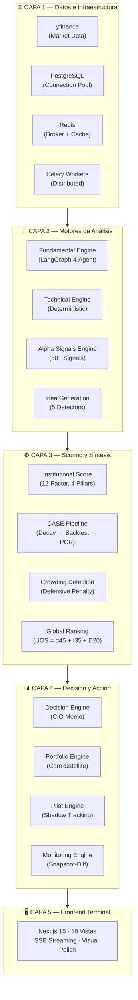
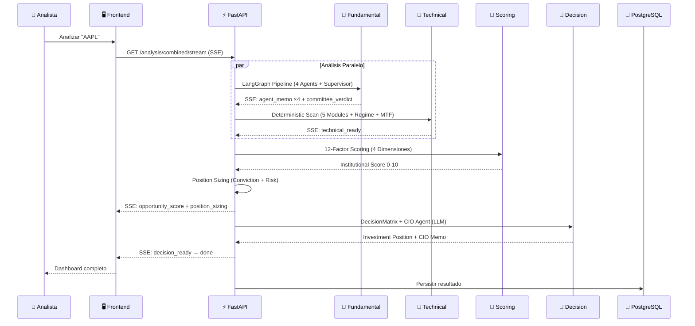
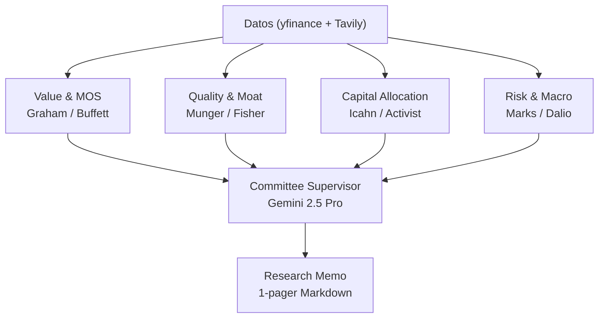
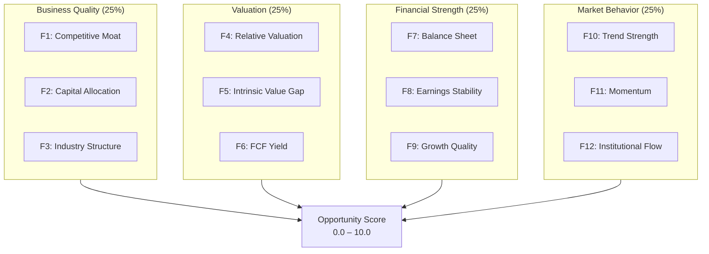
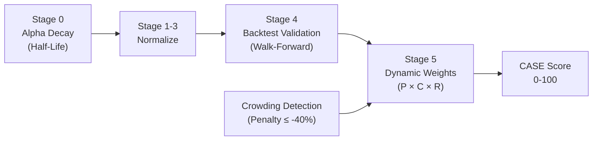

# 365 Advisers — Arquitectura de Análisis para Expertos

**Documento de Onboarding · Marzo 2026**

| Métrica del Sistema | Valor |
|---|---|
| Módulos Backend | 55 motores |
| API Routers | 31 |
| Tests Automatizados | 569 |
| Alpha Maturity Score | **82 / 100** (Institutional Grade) |
| Código Backend (Python) | ~51,400 LOC |
| Código Frontend (TypeScript) | Next.js 15 · 10 vistas |

---

## 1. Filosofía de Análisis

365 Advisers simula un **comité de inversión institucional** combinando tres paradigmas complementarios:

| Paradigma | Motor | Naturaleza |
|---|---|---|
| **Cualitativo (LLM)** | Fundamental Engine | 4 agentes LLM con marcos de inversión clásicos |
| **Cuantitativo (Determinístico)** | Technical Engine | 15+ indicadores, 100% reproducible, sin LLM |
| **Estadístico (Alpha)** | CASE Pipeline + ML | 50+ señales con decay, backtest y pesos dinámicos |

> [!IMPORTANT]
> El análisis técnico es **puramente determinístico** — elimina alucinaciones de LLM de los componentes cuantitativos. Solo los componentes de interpretación cualitativa (Fundamental, CIO Memo) utilizan modelos de lenguaje.

---

## 2. Arquitectura de 5 Capas



---

## 3. Flujo Completo de un Ticker ("El Pipeline")

Cuando un analista ejecuta un análisis para un ticker (ej. `AAPL`), el sistema ejecuta las siguientes fases via **Server-Sent Events (SSE)**:



### Los 13 Eventos SSE del Pipeline

| # | Evento | Fuente | Contenido |
|---|--------|--------|-----------|
| 1 | `data_ready` | Data Layer | Ratios, info empresa, cashflow |
| 2-5 | `agent_memo` ×4 | Fundamental | Memo por especialista |
| 6 | `committee_verdict` | Supervisor | Score 0-10, señal, narrativa |
| 7 | `research_memo` | Formatter | 1-pager en markdown |
| 8 | `technical_ready` | Technical | Score técnico + régimen + MTF |
| 9 | `source_coverage` | EDPL | Completitud de fuentes |
| 10 | `opportunity_score` | Scoring | 12 factores en 4 dimensiones |
| 11 | `position_sizing` | Sizing | Allocation, conviction, riesgo |
| 12 | `decision_ready` | Decision | Investment position + CIO Memo |
| 13 | `done` | Pipeline | Metadata final |

---

## 4. Motor Fundamental — Comité de Inversión (LangGraph)

El motor fundamental simula un comité de inversión ejecutando **4 agentes LLM en paralelo**, cada uno con un marco analítico diferente:



| Agente | Framework | Foco del Análisis |
|--------|-----------|-------------------|
| **Value & MOS** | Graham / Buffett | P/E, P/B, FCF yield, valor intrínseco, margen de seguridad |
| **Quality & Moat** | Munger / Fisher | ROIC, gross margin, pricing power, switching costs |
| **Capital Allocation** | Icahn / Activist | Buybacks, dividendos, estructura de deuda, despliegue de FCF |
| **Risk & Macro** | Marks / Dalio | Stress de apalancamiento, ciclicidad, geopolítica, tail risk |

**Output**: Cada agente produce un `AgentMemo` con: `signal` (BUY/SELL/HOLD/AVOID), `conviction` (0-1), memo narrativo, métricas clave, catalizadores y riesgos. El Supervisor sintetiza en un `CommitteeVerdict` con score 0-10.

> [!NOTE]
> Si un agente LLM falla, existe un **fallback determinístico** que genera un memo basado en reglas, evitando que una falla parcial detenga el pipeline completo.

---

## 5. Motor Técnico — Análisis Determinístico

Motor **100% sin LLM** que analiza 15+ indicadores agrupados en 5 módulos, con **detección de régimen** y **análisis multi-timeframe**.

### 5.1 Los 5 Módulos

| Módulo | Indicadores | Señales Derivadas |
|--------|------------|-------------------|
| **Trend** | SMA50, SMA200, EMA20, MACD | Golden/Death Cross, MACD Crossover |
| **Momentum** | RSI(14), Stochastic K/D | Overbought/Oversold zones |
| **Volatility** | Bollinger Bands, ATR, ATR% | BB Position, Volatility Condition |
| **Volume** | OBV, Vol vs Avg20 | Volume Status + OBV Trend |
| **Structure** | S/R Levels, Market Structure | HH/HL, LH/LL, Breakout Probability |

### 5.2 Detección de Régimen

El motor ajusta dinámicamente los pesos según el régimen de mercado detectado:

| Régimen de Tendencia | Condición (ADX) | Efecto |
|---|---|---|
| **TRENDING** | ADX > 25, DI spread > 10 | Trend ×1.2, Structure ×0.7 |
| **RANGING** | ADX < 20 | Momentum ×1.3, Structure ×1.2 |
| **VOLATILE** | ADX > 25, DI spread ≤ 10 | Volatility ×1.3 |
| **TRANSITIONING** | 20 ≤ ADX ≤ 25 | Sin ajustes |

| Régimen de Volatilidad | Condición (BB Width) | Efecto |
|---|---|---|
| **COMPRESSION** | BB width < 0.7× avg | Structure ×1.5 (breakout inminente) |
| **EXPANSION** | BB width > 1.3× avg, ATR rising | Volatility ×1.3 |
| **MEAN_REVERTING** | BB width > 1.3× avg, ATR falling | Momentum ×1.2 |

Los dos regímenes se combinan via **media geométrica**: `combined = (trend_adj × vol_adj)^0.5`

### 5.3 Scoring y Pesos

| Módulo | Peso Base | Score por Status |
|--------|-----------|-----------------|
| Trend | 30% | STRONG_BULLISH=9.5, BULLISH=7.5, NEUTRAL=5.0, BEARISH=3.0, STRONG_BEARISH=1.0 |
| Momentum | 25% | (Misma escala + contexto RSI) |
| Volatility | 20% | Contextual: NORMAL=7.0, ajuste por BB position |
| Volume | 15% | OBV trend + actividad relativa |
| Structure | 10% | Breakout probability + direction |

**Aggregate** = Σ(module_score × regime_adjusted_weight) / Σ(adjusted_weights)

### 5.4 Multi-Timeframe (MTF)

| Timeframe | Peso | Propósito |
|-----------|------|-----------|
| 1H | 10% | Filtro de ruido |
| 4H | 20% | Swing trading |
| **1D** | **40%** | **Timeframe principal** |
| 1W | 30% | Contexto macro |

Bonus/Penalty por acuerdo: ≥3 TFs alineados = ±0.5; Conflicto 1H↔1W = -0.3

---

## 6. Scoring Institucional — 12 Factores, 4 Dimensiones

El sistema califica cada oportunidad en un modelo de **12 factores** agrupados en **4 dimensiones** con peso equitativo (25% c/u):



### Fuentes por Factor

| Factor | Fuente Primaria | Fallback |
|--------|----------------|----------|
| F1-F5 | Agentes Fundamentales (Quality, Capital, Risk, Value) | Signal × Conviction |
| F6 | ROIC de financial_metrics | 5.0 neutral |
| F7 | `debt_to_equity` → `10 - (D/E × 10/3)` | Risk Agent |
| F8 | `operating_margin` → `margin × 100/3` | Quality Agent |
| F9 | Quality Agent subscores | Agent conviction |
| F10-F12 | Technical Engine subscores (trend, momentum, volume) | Technical aggregate |

---

## 7. Decision Engine — Síntesis Final

### 7.1 Matriz de Decisión

Cruza el score fundamental con el técnico para clasificar la oportunidad:

| Fund Score | Tech ≥ 7.0 | Tech 5.0-7.0 | Tech 4.0-5.0 | Tech < 4.0 |
|---|---|---|---|---|
| **≥ 8.0** | 🟢 Strong Opportunity | 🟡 Moderate | 🟡 Moderate | ⚠️ Caution |
| **6.0-8.0** | 🟡 Moderate | 🟡 Moderate | ⚪ Neutral | ⚠️ Caution |
| **4.0-6.0** | ⚠️ Speculative | ⚪ Neutral | ⚪ Neutral | 🔴 Avoid |
| **< 4.0** | ⚠️ Value Trap | 🔴 Avoid | 🔴 Avoid | 🔴 Avoid |

### 7.2 CIO Agent (LLM)

Sintetiza toda la evidencia en un memo ejecutivo en español con:
- **Thesis Summary** — Párrafo ejecutivo de la postura
- **Valuation View** — Análisis de valoración
- **Technical Context** — Timing y contexto técnico
- **Catalysts / Risks** — Catalizadores y riesgos clave
- **Enrichment** (cuando disponible): Filing context (SEC EDGAR), Geopolítica (GDELT), Macro (FRED), Sentiment

---

## 8. Alpha Intelligence Stack (10 Motores)

Más allá del pipeline de análisis por ticker, el sistema cuenta con un stack de 10 motores de alpha que alimentan señales y scores avanzados:

### Structural Alpha
| Motor | Función |
|---|---|
| **Long/Short Architecture** | Contabilidad multi-leg, costos de borrow, exposición (Gross/Net/Beta-adj) |
| **Pairs & Stat-Arb Scanner** | Cointegración Engle-Granger, modelado OU (half-life) |
| **Event Intelligence** | Catalyst scoring (Impact/Time), arbitraje M&A |

### Fundamental & Predictive Alpha
| Motor | Función |
|---|---|
| **ML Signal Factory** | 30 features, walk-forward (RF, GBM, Logistic), Model Registry |
| **Intrinsic Valuation** | DCF multi-stage, comparables ponderados, Graham Number |

### Institutional Infrastructure
| Motor | Función |
|---|---|
| **Options Analytics** | Black-Scholes, 5-Greeks (δ,γ,θ,ν,ρ), IV solver Newton-Raphson |
| **Broker-Integrated OMS** | Lifecycle de órdenes, adaptadores (Paper/Alpaca/IB) |
| **Multi-Asset Data** | Equity, FX, Crypto, Fixed Income — correlación cross-asset |
| **Capital Allocation** | Risk-Parity, Momentum-Tilt, Inverse-Vol |
| **Risk Engine (VaR/CVaR)** | Histórico, Paramétrico, Monte Carlo + stress testing |

---

## 9. Composite Alpha Score Engine (CASE Pipeline)

El CASE Pipeline transforma las 50+ señales alpha en un score normalizado 0-100:



**Modelo de Pesos Dinámicos (P × C × R)**:
- **P(s)** — Performance: Sharpe + Hit Rate blend
- **C(s)** — Confidence: Sample size + p-value reliability
- **R(s)** — Recency: Exponential decay desde última validación

**Global Ranking (UOS)** = Alpha (45%) + Institutional (35%) + Detector (20%)

---

## 10. Quant Research Platform (QRP)

Stack de 8 capas para transformar datos en estrategias validadas:

| # | Capa | Función |
|---|------|---------|
| 1 | Research Data | Features versionados, snapshots Point-In-Time |
| 2 | Signal Research Lab | IC, IC_IR, bootstrap stability, redundancy clustering |
| 3 | Alpha Detection & Decay | 50+ signals, half-life por estilo (Momentum vs Value) |
| 4 | Strategy Composer | Definición declarativa (YAML), entry/exit rules, régimen |
| 5 | Backtest Engine | Walk-forward, Almgren-Chriss market impact |
| 6 | Portfolio Lab | Multi-strategy blending, Brinson Attribution |
| 7 | Surveillance | Snapshot-diff, crowding detection, alertas |
| 8 | Live Performance | Daily MTM P&L, Sharpe, Volatility tracking |

---

## 11. Strategy Definition Framework (SDF)

Las estrategias se definen declarativamente en **YAML** y pasan por un lifecycle institucional:

```
Draft → Research → Backtested → Validated → Paper → Live → Paused/Retired
```

**6 Estrategias Verificadas en Producción**:

| Estrategia | Categoría | Sharpe | Return Anual | Win Rate |
|---|---|---|---|---|
| Momentum Quality v2 | Momentum | **2.1** | 24.3% | 82% |
| AI Infra Thematic | Event | 1.8 | 31.2% | 68% |
| Stable Dividends v4 | Quality | 1.4 | 12.8% | 75% |
| Contrarian Value | Value | 1.1 | 18.2% | 55% |
| Trend Mastery | Momentum | 1.3 | 21.1% | 61% |
| Volatility Shield | Volatility | 1.5 | 9.5% | 88% |

---

## 12. Infraestructura y Resiliencia

| Componente | Stack | Rol |
|---|---|---|
| Backend API | FastAPI + APIRouters | REST + SSE streaming |
| Frontend | Next.js 15 (React) | Terminal institucional 10 vistas |
| Base de Datos | PostgreSQL + SQLAlchemy | Connection pooling + Alembic migrations |
| Task Queue | Celery + Redis | Escaneo distribuido de mercado |
| Cache | CacheManager 2-tier | Fundamental=24h, Technical=15m |
| Resiliencia | Circuit Breakers + Backoff | Protección ante providers externos |
| Seguridad | Rate Limit (30 req/min) + Pydantic Settings | Validación estricta |
| Data Providers | yfinance, TradingView-TA, Tavily, SEC EDGAR, GDELT, FRED | Multi-source |

---

## 13. Mapa de Archivos Clave

```
agent-backend/src/
├── routes/analysis.py              ← 7 API endpoints del módulo Analysis
├── orchestration/
│   ├── analysis_pipeline.py        ← Orquestador SSE de 13 pasos
│   └── sse_streamer.py             ← Helpers de formato SSE
├── engines/
│   ├── fundamental/                ← LangGraph 4-Agent Committee
│   ├── technical/                  ← 5 módulos determinísticos + Regime + MTF
│   ├── scoring/                    ← 12-Factor Opportunity Model
│   ├── decision/                   ← DecisionMatrix + CIO Agent
│   ├── composite_alpha/            ← CASE Pipeline (5 stages)
│   ├── alpha_signals/              ← 50+ señales en 8 categorías
│   ├── ml_signals/                 ← ML Signal Factory
│   ├── risk/                       ← VaR/CVaR Engine
│   ├── options_pricing/            ← Black-Scholes + Greeks
│   ├── oms/                        ← Order Management + Broker Adapters
│   └── ... (55 engine modules)
├── contracts/                      ← Pydantic models tipados por capa
├── data/
│   ├── market_data.py              ← yfinance + TradingView fetcher
│   ├── external/                   ← EDPL (SEC EDGAR, GDELT)
│   └── providers/                  ← MTF, Financials, Price History
└── services/cache_manager.py       ← Multi-tier cache
```

---

## 14. Glosario para el Equipo

| Término | Definición |
|---|---|
| **CASE** | Composite Alpha Score Engine — pipeline multi-stage de scoring alpha |
| **UOS** | Unified Opportunity Score — score global ponderado (Alpha+Institutional+Detector) |
| **EDPL** | External Data Provider Layer — integración resiliente con fuentes externas |
| **MTF** | Multi-Timeframe — análisis simultáneo en 4 marcos temporales |
| **SSE** | Server-Sent Events — protocolo de streaming servidor→cliente |
| **CIO** | Chief Investment Officer — agente LLM que sintetiza la decisión final |
| **Régimen** | Clasificación del estado de mercado (trending, ranging, volatile, etc.) |
| **P×C×R** | Performance × Confidence × Recency — modelo de pesos dinámicos para señales |
| **SDF** | Strategy Definition Framework — marco declarativo (YAML) para estrategias |
| **QRP** | Quant Research Platform — stack de 8 capas para investigación cuantitativa |
| **HH/HL** | Higher Highs & Higher Lows — estructura alcista de mercado |
| **LH/LL** | Lower Highs & Lower Lows — estructura bajista de mercado |

---

*Generado por 365 Advisers Engineering · Marzo 2026 · Alpha Maturity Score: 82/100*
