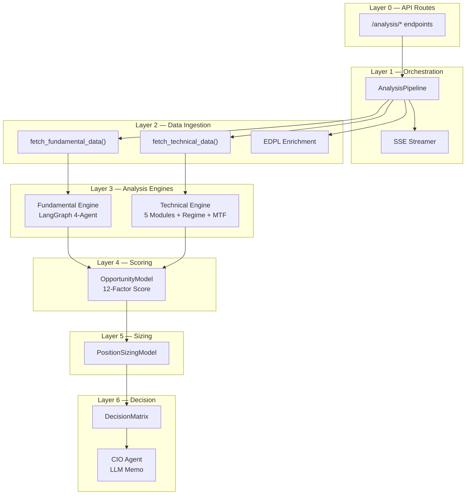
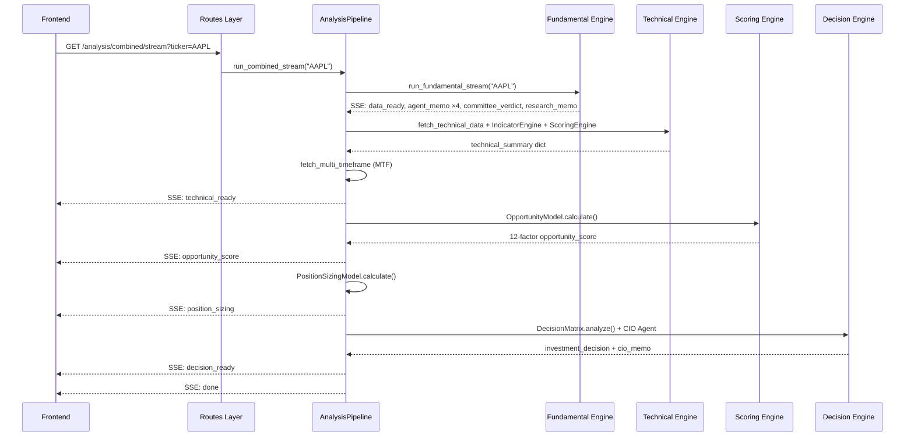
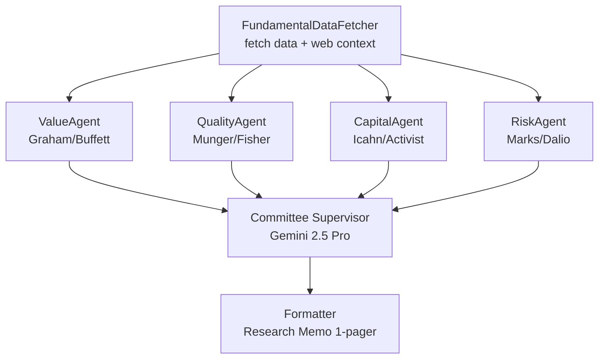
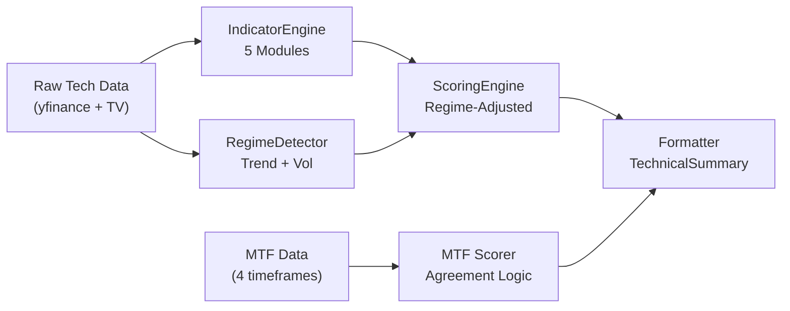
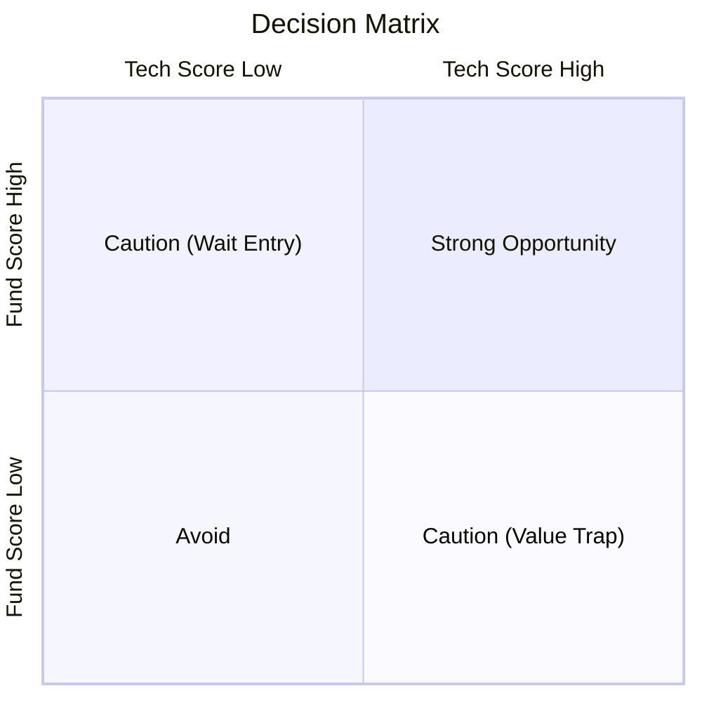

# Manual Técnico — Módulo Analysis

**365 Advisers · Plataforma de Inteligencia de Inversión**

| Metadato | Valor |
|----------|-------|
| **Módulo** | Analysis |
| **Versión** | 3.1 |
| **Fecha** | Marzo 2026 |
| **Clasificación** | Interno — Ingeniería |
| **Autor** | 365 Advisers Engineering |

---

## Tabla de Contenidos

1. [Resumen Ejecutivo](#1-resumen-ejecutivo)
2. [Arquitectura General](#2-arquitectura-general)
3. [Submódulo 1: API Routes Layer](#3-submódulo-1-api-routes-layer)
4. [Submódulo 2: Orchestration Pipeline](#4-submódulo-2-orchestration-pipeline)
5. [Submódulo 3: Fundamental Engine](#5-submódulo-3-fundamental-engine)
6. [Submódulo 4: Technical Engine](#6-submódulo-4-technical-engine)
7. [Submódulo 5: Scoring Engine](#7-submódulo-5-scoring-engine)
8. [Submódulo 6: Decision Engine](#8-submódulo-6-decision-engine)
9. [Data Layer y Providers](#9-data-layer-y-providers)
10. [Contratos y Modelos de Datos](#10-contratos-y-modelos-de-datos)
11. [Configuración y Dependencias](#11-configuración-y-dependencias)
12. [Apéndices](#12-apéndices)

---

## 1. Resumen Ejecutivo

El módulo **Analysis** es el núcleo de la plataforma 365 Advisers. Su responsabilidad es ejecutar el flujo completo de análisis de una empresa cotizada — desde la obtención de datos de mercado hasta la generación de una decisión de inversión institucional con memo del CIO.

### Capacidades Principales

- **Análisis Fundamental** mediante 4 agentes LLM especializados (LangGraph) con marcos institucionales (Graham, Munger, Icahn, Marks/Dalio)
- **Análisis Técnico** mediante 5 módulos determinísticos (Trend, Momentum, Volatility, Volume, Structure) con detección de régimen y análisis multi-timeframe
- **Scoring Institucional** de 12 factores agrupados en 4 dimensiones (Business Quality, Valuation, Financial Strength, Market Behavior)
- **Position Sizing** basado en conviction y riesgo
- **Decision Engine** con clasificación matricial y memo del CIO (LLM)
- **Streaming SSE** de 10 pasos para feedback en tiempo real al frontend
- **Enrichment Pipeline** con datos de SEC EDGAR, GDELT, FRED y sentiment

### Métricas del Módulo

| Métrica | Valor |
|---------|-------|
| Archivos fuente backend | 20+ |
| Endpoints API | 7 |
| Motores de análisis | 3 (Fundamental, Technical, Decision) |
| Agentes LLM | 5 (4 analistas + 1 CIO) |
| Módulos técnicos | 5 |
| Factores de scoring | 12 |
| Eventos SSE en pipeline | 10 |
| Fuentes de datos externa | yfinance, TradingView-TA, Tavily, SEC EDGAR, GDELT |

---

## 2. Arquitectura General

### 2.1 Diagrama de Capas



### 2.2 Flujo de Datos Principal



---

## 3. Submódulo 1: API Routes Layer

### 3.1 Descripción

**Archivo fuente:** `src/routes/analysis.py`

Expone 7 endpoints HTTP que sirven como interfaz entre el frontend y los motores de análisis. Maneja cache, validación de parámetros, y formato de respuesta.

### 3.2 Instancia del Router

```python
router = APIRouter(tags=["Analysis"])
cache     = cache_manager.analysis
tech_cache = cache_manager.technical
fund_cache = cache_manager.fundamental
decision_cache = cache_manager.decision
pipeline = AnalysisPipeline(fund_cache, tech_cache, decision_cache)
```

### 3.3 Referencia de Endpoints

| # | Método | Ruta | Tipo | Descripción | Cache |
|---|--------|------|------|-------------|-------|
| 1 | `GET` | `/analysis/combined/stream` | SSE | Pipeline completo: Fundamental + Technical + Scoring + Decision | fund + tech + decision |
| 2 | `GET` | `/analysis/fundamental/stream` | SSE | Solo análisis fundamental (4 agentes + committee) | fund_cache |
| 3 | `GET` | `/analysis/technical` | JSON | Solo análisis técnico + MTF + Regime | tech_cache (15 min) |
| 4 | `GET` | `/ticker-info` | JSON | Nombre + precio rápido (para watchlist) | analysis cache |
| 5 | `GET` | `/compare` | JSON | Análisis comparativo de hasta 3 tickers en paralelo | analysis cache |
| 6 | `GET` | `/analyze/stream` | SSE | **DEPRECATED** — Legacy SSE endpoint | analysis cache |
| 7 | `POST` | `/analyze` | JSON | **DEPRECATED** — Legacy blocking endpoint | — |

### 3.4 Parámetros Comunes

| Parámetro | Tipo | Requerido | Descripción |
|-----------|------|-----------|-------------|
| `ticker` | `string` | Sí | Símbolo bursátil (e.g., "AAPL"). Auto-normalizado a mayúsculas |
| `force` | `bool` | No | Si `true`, ignora cache y fuerza recálculo |
| `tickers` | `string` | Solo `/compare` | Lista CSV de hasta 3 símbolos |

### 3.5 Endpoint Principal: `/analysis/combined/stream`

**Flujo interno:**
1. Recibe `ticker` y `force` como query params
2. Delega a `pipeline.run_combined_stream()`
3. Retorna `StreamingResponse` con SSE
4. Headers: `Cache-Control: no-cache`, `X-Accel-Buffering: no`

### 3.6 Endpoint Técnico: `/analysis/technical`

**Flujo interno:**
1. Verifica `tech_cache.get(symbol)` → retorna con `from_cache: true` si existe
2. Llama `fetch_technical_data(symbol)` en thread separado
3. Ejecuta `IndicatorEngine.compute()` → `IndicatorResult`
4. Ejecuta `TrendRegimeDetector.detect()` + `VolatilityRegimeDetector.detect()`
5. Combina régimen → `combine_regime_adjustments()`
6. Ejecuta `ScoringEngine.compute()` con ajuste de régimen
7. Formatea con `build_technical_summary()`
8. Ejecuta MTF: `fetch_multi_timeframe()` → `MultiTimeframeScorer.compute()`
9. Guarda en cache y retorna

---

## 4. Submódulo 2: Orchestration Pipeline

### 4.1 Descripción

**Archivos fuente:**
- `src/orchestration/analysis_pipeline.py` — Orquestador principal
- `src/orchestration/sse_streamer.py` — Helpers de formato SSE

El pipeline orquesta las 6 capas del análisis en secuencia, emitiendo **10 eventos SSE** conforme cada capa completa su trabajo.

### 4.2 Clase `AnalysisPipeline`

```python
class AnalysisPipeline:
    def __init__(self, fund_cache, tech_cache, decision_cache):
        self.fund_cache = fund_cache
        self.tech_cache = tech_cache
        self.decision_cache = decision_cache

    async def run_combined_stream(self, ticker: str, force: bool = False):
        # Async generator que produce SSE events
```

### 4.3 Los 10 Eventos SSE del Pipeline

| # | Evento | Fuente | Payload |
|---|--------|--------|---------|
| 1 | `data_ready` | Fundamental Engine | Ratios financieros, info empresa, cashflow series |
| 2-5 | `agent_memo` ×4 | Fundamental Engine | Memo de cada agente (Value, Quality, Capital, Risk) |
| 6 | `committee_verdict` | Fundamental Engine | Score 0-10, señal, narrativa, catalizadores, riesgos |
| 7 | `research_memo` | Fundamental Engine | Memo de investigación en markdown |
| 8 | `technical_ready` | Technical Engine | Score técnico, indicadores, régimen, MTF |
| 9 | `source_coverage` | EDPL Coverage | Completitud de fuentes de datos, freshness |
| 10 | `opportunity_score` | Scoring Engine | 12-Factor score, dimensiones, factores |
| 11 | `position_sizing` | Sizing Engine | Allocation, conviction, risk level |
| 12 | `decision_ready` | Decision Engine | Investment position, CIO memo, enrichment |
| 13 | `done` | Pipeline | `from_cache`, `analysis_id` |

### 4.4 Pipeline Steps Detallados

#### Part 1: Fundamental Engine
- Verifica `fund_cache` → si hit, replay eventos de cache
- Si miss, ejecuta `run_fundamental_stream()` como async generator
- Colecta todos los eventos y los guarda en `fund_cache` al completar
- Extrae `committee_verdict` para uso downstream

#### Part 2: Technical Engine
- Verifica `tech_cache` → si hit, usa datos cacheados
- Si miss: `fetch_technical_data()` → `IndicatorEngine.compute()` → Regime Detection → `ScoringEngine.compute()` → `build_technical_summary()`
- Guarda en `tech_cache`

#### Part 2b: Multi-Timeframe (MTF)
- `fetch_multi_timeframe(symbol)` obtiene datos de 4 timeframes
- `MultiTimeframeScorer.compute()` agrega con lógica de agreement/conflict
- Inserta bloque `mtf` en `tech_data`
- **Non-fatal**: si falla, el análisis de 1 TF sigue válido

#### Part 2.5: EDPL Source Coverage
- `_fetch_edpl_enrichment()` consulta proveedores externos (SEC EDGAR, GDELT)
- `CoverageTracker` calcula completitud de fuentes
- Emite `source_coverage` con score y mensajes

#### Part 3: Opportunity Score
- `OpportunityModel.calculate()` con ratios fundamentales + agentes + tech summary
- Persiste a DB: tabla `OpportunityScoreHistory`
- Emite `opportunity_score`

#### Part 4: Position Sizing
- `PositionSizingModel.calculate()` basado en opportunity score + risk condition
- Emite `position_sizing`

#### Part 5: Decision Engine
- `DecisionMatrix.analyze()` → investment position + confidence
- `synthesize_investment_memo()` → CIO Memo (LLM-powered, enriched con EDPL)
- Guarda en `decision_cache`
- Emite `decision_ready`

### 4.5 SSE Streamer

**Funciones de utilidad:**

```python
def sse(event: str, data: dict) -> str:
    """Format: event: {event}\ndata: {json}\n\n"""

async def replay_cached_events(events, delay=0.02):
    """Replay cached SSE events with inter-event delay"""

async def replay_fundamental_cache(cached_data):
    """Replay cached fundamental + done event"""

async def replay_legacy_cache(ticker, entry):
    """Replay data_ready + agents + dalio for legacy endpoint"""
```

---

## 5. Submódulo 3: Fundamental Engine

### 5.1 Descripción

**Archivos fuente:**
- `src/engines/fundamental/graph.py` — LangGraph multi-agent system
- `src/engines/fundamental/engine.py` — Façade con contratos tipados

Motor de análisis fundamental basado en **LangGraph** que ejecuta **4 agentes analistas LLM en paralelo**, seguidos de un **Committee Supervisor** que sintetiza los memos en un veredicto final.

### 5.2 Arquitectura del Grafo



### 5.3 Configuración LLM

| Componente | Modelo | Propósito |
|------------|--------|-----------|
| 4 Agents | `gemini-2.5-flash` | Análisis rápido por especialista |
| Committee Supervisor | `gemini-2.5-pro` | Síntesis de alta calidad |
| Web Search | Tavily | Contexto adicional de mercado |

### 5.4 Los 4 Agentes Analistas

| Agente | Framework | Foco del Análisis |
|--------|-----------|-------------------|
| **Value & Margin of Safety** | Benjamin Graham / Warren Buffett | P/E, P/B, FCF yield, intrinsic value, margin of safety |
| **Quality & Moat** | Charlie Munger / Phil Fisher | ROIC, gross margin, pricing power, switching costs |
| **Capital Allocation** | Carl Icahn / Activist | Buybacks, dividends, debt levels, FCF deployment |
| **Risk & Macro Stress** | Howard Marks / Ray Dalio | Leverage stress, cyclicality, geopolitical, tail risk |

### 5.5 State Schema (LangGraph)

```python
class FundamentalState(TypedDict):
    ticker: str
    fundamental_data: dict       # Output de fetch_fundamental_data()
    web_context: list[dict]      # Resultados de Tavily search
    agent_memos: Annotated[list[AgentMemo], operator.add]  # Fan-out accumulator
    committee_output: CommitteeOutput
    research_memo: str
```

### 5.6 Output de Cada Agente (`AgentMemo`)

```python
{
    "agent": "Value & Margin of Safety",
    "framework": "Benjamin Graham / Warren Buffett — Intrinsic Value, DCF, MoS",
    "signal": "BUY",          # BUY | SELL | HOLD | AVOID
    "conviction": 0.85,       # 0.0 – 1.0
    "memo": "Análisis en español...",
    "key_metrics_used": ["P/E", "FCF Yield"],
    "catalysts": ["Expansión de márgenes"],
    "risks": ["Regulación antimonopolio"],
    "is_fallback": false
}
```

### 5.7 Output del Committee (`CommitteeOutput`)

```python
{
    "signal": "BUY",
    "score": 7.8,                    # 0–10
    "confidence": 0.72,              # 0.0–1.0
    "risk_adjusted_score": 6.5,      # 0–10
    "consensus_narrative": "Narrativa institucional en español...",
    "key_catalysts": ["..."],
    "key_risks": ["..."],
    "allocation_recommendation": "Sobreponderar"
}
```

### 5.8 Research Memo

El `node_formatter` genera un memo de investigación en markdown con:
- Veredicto del Comité (tabla con score, señal, confianza)
- Métricas de Valoración Clave (P/E, P/B, EV/EBITDA, ROIC)
- Memos de cada analista
- Catalizadores y Riesgos Clave

### 5.9 Streaming Events

| Orden | Evento | Trigger |
|-------|--------|---------|
| 1 | `data_ready` | `FundamentalDataFetcher` completa |
| 2-5 | `agent_memo` ×4 | Cada agente completa (paralelo) |
| 6 | `committee_verdict` | Committee Supervisor completa |
| 7 | `research_memo` | Formatter completa |
| 8 | `done` | Stream completado |

### 5.10 Tolerancia a Fallos

- Cada agente tiene un **fallback determinístico** si la llamada LLM falla
- `_safe_agent_call()` captura excepciones y retorna `AgentMemo` con `is_fallback: true`
- `fetch_fundamental_data()` tiene timeout de 25 segundos con fallback a datos vacíos
- Tavily search falla silenciosamente (solo añade contexto extra)

---

## 6. Submódulo 4: Technical Engine

### 6.1 Descripción

**Archivos fuente:**
- `src/engines/technical/engine.py` — Façade (TechnicalEngine)
- `src/engines/technical/indicators.py` — 5 módulos de indicadores
- `src/engines/technical/scoring.py` — Scoring determinístico
- `src/engines/technical/regime_detector.py` — Detección de régimen
- `src/engines/technical/mtf_scorer.py` — Multi-Timeframe Scorer
- `src/engines/technical/formatter.py` — Output formatter

Motor **100% determinístico** (sin LLM) que analiza indicadores técnicos, detecta el régimen de mercado activo, y produce un score 0-10 ajustado dinámicamente.

### 6.2 Pipeline Interno



### 6.3 Los 5 Módulos de Indicadores

#### 6.3.1 TrendModule

**Indicadores:** SMA50, SMA200, EMA20, MACD (value, signal, histogram)

**Señales derivadas:**

| Signal | Condición |
|--------|-----------|
| Golden Cross | SMA50 > SMA200 |
| Death Cross | SMA50 < SMA200 |
| MACD Crossover | MACD > Signal = BULLISH, MACD < Signal = BEARISH |
| Price vs SMA | ABOVE/BELOW/AT (threshold ±0.5%) |

**Status Logic:**
- `STRONG_BULLISH`: 4/4 señales bullish
- `BULLISH`: 2-3/4 señales bullish
- `NEUTRAL`: 1/4
- `BEARISH`: 0/4 con señales bearish
- `STRONG_BEARISH`: 3+ señales bearish

#### 6.3.2 MomentumModule

**Indicadores:** RSI (14), Stochastic K/D

**Zonas:**

| Indicador | Overbought | Neutral | Oversold |
|-----------|------------|---------|----------|
| RSI | ≥ 70 | 30-70 | ≤ 30 |
| Stochastic | ≥ 80 | 20-80 | ≤ 20 |

**Status Logic:**
- `STRONG_BULLISH`: RSI oversold + Stoch oversold
- `STRONG_BEARISH`: RSI overbought + Stoch overbought
- Zona neutral con bias: RSI > 55 → BULLISH, RSI < 45 → BEARISH

#### 6.3.3 VolatilityModule

**Indicadores:** Bollinger Bands (upper, lower, basis, width), ATR, ATR%

**BB Position:** Price location within bands

| Position | Range |
|----------|-------|
| `UPPER` | ≥ 85% |
| `UPPER_MID` | 60-85% |
| `MID` | 40-60% |
| `LOWER_MID` | 15-40% |
| `LOWER` | < 15% |

**Volatility Condition (basado en ATR%):**

| Condition | ATR% |
|-----------|------|
| `HIGH` | ≥ 4.0% |
| `ELEVATED` | 2.5-4.0% |
| `NORMAL` | 1.0-2.5% |
| `LOW` | < 1.0% |

#### 6.3.4 VolumeModule

**Indicadores:** OBV, Current Volume, Volume vs 20-period Average

**OBV Trend:** Derivado de dirección de precio en últimos 5 días + signo de OBV

**Volume Status:**

| Status | Volume Ratio (vs avg) |
|--------|----------------------|
| `STRONG` | ≥ 1.5× |
| `NORMAL` | 0.7-1.5× |
| `WEAK` | < 0.7× |

#### 6.3.5 StructureModule (V2)

**Funcionalidades:**
- Detección de Soporte/Resistencia via pivot highs/lows (window=5, últimos 60 días)
- Clustering de niveles S/R dentro de banda de 1%
- **V2: Market Structure** — HH_HL (uptrend), LH_LL (downtrend), MIXED
- **V2: Level Strength** — Conteo de "touches" (0.5% proximity)
- **V2: Pattern Recognition** — DOUBLE_TOP, DOUBLE_BOTTOM, HIGHER_LOWS, LOWER_HIGHS
- Breakout Probability (0-0.95) ajustado por structure + patterns

### 6.4 Regime Detection

#### 6.4.1 TrendRegimeDetector

**Inputs:** ADX, +DI, -DI

| Régimen | Condición | Efecto en Pesos |
|---------|-----------|-----------------|
| `TRENDING` | ADX > 25, DI spread > 10 | trend ×1.2, structure ×0.7 |
| `RANGING` | ADX < 20 | trend ×0.8, momentum ×1.3, structure ×1.2 |
| `VOLATILE` | ADX > 25, DI spread ≤ 10 | volatility ×1.3 |
| `TRANSITIONING` | 20 ≤ ADX ≤ 25 | todos ×1.0 |

#### 6.4.2 VolatilityRegimeDetector

**Inputs:** BB width history (OHLCV), ATR trend

| Régimen | Condición | Efecto en Pesos |
|---------|-----------|-----------------|
| `COMPRESSION` | BB width < 0.7× avg, ATR falling/flat | structure ×1.5 (breakout imminent) |
| `EXPANSION` | BB width > 1.3× avg, ATR rising | volatility ×1.3, structure ×0.5 |
| `MEAN_REVERTING` | BB width > 1.3× avg, ATR falling | momentum ×1.2 |
| `STABLE` | Otherwise | todos ×1.0 |

#### 6.4.3 Combinación de Régimen

Los ajustes se combinan usando **media geométrica** para evitar que un régimen domine excesivamente:

```python
combined[module] = (trend_adj * vol_adj) ** 0.5
```

### 6.5 Technical ScoringEngine

**Pesos por defecto:**

| Módulo | Peso Base |
|--------|-----------|
| Trend | 0.30 |
| Momentum | 0.25 |
| Volatility | 0.20 |
| Volume | 0.15 |
| Structure | 0.10 |

**Score por módulo:** Mapeo de status a 0-10:

| Status | Score Base |
|--------|-----------|
| STRONG_BULLISH | 9.5 |
| BULLISH | 7.5 |
| NEUTRAL | 5.0 |
| BEARISH | 3.0 |
| STRONG_BEARISH | 1.0 |

**Volatility scoring** es contextual: NORMAL = 7.0, con ajuste por BB position (LOWER = +1.5 bounce potential, UPPER = -1.0 overbought).

**Structure scoring** usa breakout probability + direction + V2 data para score no-lineal.

**Aggregate = Σ(module_score × adjusted_weight) / Σ(adjusted_weights)**

**Signal derivation:**

| Score | Signal |
|-------|--------|
| ≥ 8.0 | STRONG_BUY |
| 6.5-8.0 | BUY |
| 4.5-6.5 | NEUTRAL |
| 3.0-4.5 | SELL |
| < 3.0 | STRONG_SELL |

### 6.6 Multi-Timeframe Scorer (MTF)

**Timeframes y pesos:**

| Timeframe | Peso | Propósito |
|-----------|------|-----------|
| 1H | 0.10 | Noise filter (bajo peso) |
| 4H | 0.20 | Swing trading |
| 1D | 0.40 | **Primary** timeframe |
| 1W | 0.30 | Macro context |

**Proceso:**
1. Para cada TF disponible: `IndicatorEngine.compute()` + `ScoringEngine.compute()`
2. Regime adjustments se aplican **solo al TF de 1D**
3. Weighted average de scores

**Agreement Logic:**

| Condición | Efecto |
|-----------|--------|
| ≥ 3 TFs bullish | Bonus: +0.5 |
| ≥ 3 TFs bearish | Penalty: -0.5 |
| 1H ↔ 1W conflict | Penalty: -0.3 |

**Agreement Level:**

| Count | Label |
|-------|-------|
| ≥ 3 | STRONG |
| 2 | MODERATE |
| < 2 | WEAK |

### 6.7 Formatter

**Archivo:** `src/engines/technical/formatter.py`

`build_technical_summary()` ensambla todos los resultados en un dict JSON con:

| Sección | Contenido |
|---------|-----------|
| `ticker` / `timestamp` / `interval` | Metadata |
| `current_price` / `exchange` | Market data |
| `indicators` | 5 bloques: trend, momentum, volatility, volume, structure |
| `summary` | Status de cada módulo + subscores + signal + strength |
| `regime` | trend_regime, vol_regime, weight_adjustments |
| `tradingview_rating` | TV benchmark (recommendation, buy/sell/neutral counts) |
| `active_indicators` | Lista de 12 indicadores activos |
| `processing_time_ms` | Latencia end-to-end |

---

## 7. Submódulo 5: Scoring Engine

### 7.1 Descripción

**Archivos fuente:**
- `src/engines/scoring/engine.py` — Façade (`InstitutionalScoringEngine`)
- `src/engines/scoring/opportunity_model.py` — 12-Factor Model
- `src/engines/scoring/signal_bridge.py` — Alpha Signals integration

Calcula el **Institutional Opportunity Score** (0-10) combinando inputs fundamentales, técnicos, y signals en un modelo de 12 factores agrupados en 4 dimensiones.

### 7.2 Las 4 Dimensiones y 12 Factores

```mermaid
graph TD
    OPP["Opportunity Score<br/>0-10"]

    subgraph "Business Quality (25%)"
        BQ1["F1: Competitive Moat<br/>(Quality Agent)"]
        BQ2["F2: Management Capital Allocation<br/>(Capital Agent)"]
        BQ3["F3: Industry Structure<br/>(Risk Agent)"]
    end

    subgraph "Valuation (25%)"
        V1["F4: Relative Valuation<br/>(Value Agent)"]
        V2["F5: Intrinsic Value Gap<br/>(Value Agent)"]
        V3["F6: FCF Yield<br/>(ROIC proxy)"]
    end

    subgraph "Financial Strength (25%)"
        FS1["F7: Balance Sheet Strength<br/>(D/E ratio)"]
        FS2["F8: Earnings Stability<br/>(Op. Margin)"]
        FS3["F9: Growth Quality<br/>(Quality Agent)"]
    end

    subgraph "Market Behavior (25%)"
        MB1["F10: Trend Strength<br/>(Technical)"]
        MB2["F11: Momentum<br/>(Technical)"]
        MB3["F12: Institutional Flow<br/>(Volume proxy)"]
    end

    BQ1 --> OPP
    BQ2 --> OPP
    BQ3 --> OPP
    V1 --> OPP
    V2 --> OPP
    V3 --> OPP
    FS1 --> OPP
    FS2 --> OPP
    FS3 --> OPP
    MB1 --> OPP
    MB2 --> OPP
    MB3 --> OPP
```



### 7.3 Fuente de Cada Factor

| Factor | Fuente Primaria | Fallback |
|--------|----------------|----------|
| F1: Competitive Moat | Quality & Moat Agent subscores | Agent signal × conviction |
| F2: Mgmt Capital Allocation | Capital Allocation Agent subscores | Agent signal × conviction |
| F3: Industry Structure | Risk & Macro Agent subscores | Agent signal × conviction |
| F4: Relative Valuation | Value Agent subscores | Agent signal × conviction |
| F5: Intrinsic Value Gap | Value Agent subscores | Agent signal × conviction |
| F6: FCF Yield | ROIC de financial_metrics | 5.0 (neutral) |
| F7: Balance Sheet Strength | `debt_to_equity` → formula: `10 - (D/E × 10/3)` | Risk Agent conf |
| F8: Earnings Stability | `operating_margin` → formula: `margin × 100/3` | Quality Agent conf |
| F9: Growth Quality | Quality Agent subscores | Agent signal × conviction |
| F10: Trend Strength | Technical module subscore "trend" | Technical aggregate |
| F11: Momentum | Technical module subscore "momentum" | Technical aggregate |
| F12: Institutional Flow | Technical module subscore "volume" (OBV proxy) | Technical aggregate |

### 7.4 Cálculo del Score

```
Dimension = Average(3 factors in dimension)
Opportunity Score = Σ(Dimension × 0.25) for each of 4 dimensions
```

Pesos iguales (25%) para cada dimensión.

### 7.5 Alpha Signals Integration

Si `CompositeAlphaResult` está disponible (del Composite Alpha Engine):
1. `compute_case_factor_adjustments()` — calcula ajustes por categoría alpha
2. `compute_case_alpha_weight()` — determina peso del alpha signal
3. `blend_signal_adjustments()` — mezcla ajustes en los 12 factores

Fallback a `SignalProfile` legacy con peso fijo de 0.30.

### 7.6 Output Contract

```python
{
    "opportunity_score": 7.25,     # 0-10
    "dimensions": {
        "business_quality": 7.8,
        "valuation": 6.5,
        "financial_strength": 7.2,
        "market_behavior": 7.5
    },
    "factors": {
        "competitive_moat": 8.0,
        "management_capital_allocation": 7.5,
        # ... 12 factores total
    },
    "recorded_at": "2026-03-11T..."
}
```

---

## 8. Submódulo 6: Decision Engine

### 8.1 Descripción

**Archivos fuente:**
- `src/engines/decision/engine.py` — Façade (`DecisionEngine`)
- `src/engines/decision/classifier.py` — DecisionMatrix determinística
- `src/engines/decision/cio_agent.py` — CIO Synthesizer (LLM)

Sintetiza todos los resultados upstream en una **decisión de inversión final** con clasificación matricial y memo del CIO.

### 8.2 DecisionMatrix — Clasificación

**Algoritmo no-lineal** basado en fund_score × tech_score:



**Tabla de posiciones completa:**

| Fund Score | Tech ≥ 7.0 | Tech 5.0-7.0 | Tech 4.0-5.0 | Tech < 4.0 |
|------------|-----------|-------------|-------------|-----------|
| **≥ 8.0** | 🟢 Strong Opportunity | 🟡 Moderate Opportunity | 🟡 Moderate Opportunity | ⚠️ Caution (Wait Entry) |
| **6.0-8.0** | 🟡 Moderate Opportunity | 🟡 Moderate Opportunity | ⚪ Neutral | ⚠️ Caution (Wait Entry) |
| **4.0-6.0** | ⚠️ Caution (Speculative) | ⚪ Neutral | ⚪ Neutral | 🔴 Avoid |
| **< 4.0** | ⚠️ Caution (Value Trap) | 🔴 Avoid | 🔴 Avoid | 🔴 Avoid |

### 8.3 Confidence Score

Confidence unificada con penalización por divergencia:

```
divergence = abs(fund_score - tech_score)
penalty = (divergence / 10.0) × 0.30
final_confidence = fund_confidence × (1.0 - penalty)
```

Máxima penalización por divergencia: 30%.

### 8.4 CIO Agent — Investment Memo

**Modelo LLM:** Configurado via `settings.LLM_MODEL`

**Flujo:**
1. Recibe: ticker, investment_position, fundamental_verdict, technical_summary, opportunity_data, position_data
2. Construye **enrichment blocks** si están disponibles:
   - **SEC EDGAR**: Filing events, material 8-K, ownership filings
   - **GDELT**: Geopolitical risk index, event spikes, dominant themes
   - **FRED Extended**: GDP, NFP, retail sales, consumer confidence
   - **Sentiment**: Geopolitical tone, event count 48h
3. Genera prompt institucional en español
4. **Output**:

```python
{
    "thesis_summary": "Párrafo ejecutivo justificando la postura...",
    "valuation_view": "Análisis de valoración...",
    "technical_context": "Contexto técnico y timing...",
    "key_catalysts": ["Catalizador 1", "Catalizador 2"],
    "key_risks": ["Riesgo 1", "Riesgo 2"],
    # Enrichment sections (when data available):
    "filing_context": "Lo que revelan los filings de la SEC...",
    "geopolitical_context": "Riesgo geopolítico y su impacto...",
    "macro_environment": "Contexto macro e implicaciones...",
    "sentiment_context": "Señales de sentiment de noticias..."
}
```

### 8.5 Fallback Determinístico

Si la llamada LLM falla, `_generate_rule_based_memo()` genera un memo basado en reglas:
- Score ≥ 7.5 → "Strong investment opportunity..."
- Score 5.0-7.5 → "Moderate opportunity..."
- Score < 5.0 → "Below-average opportunity..."

---

## 9. Data Layer y Providers

### 9.1 Descripción

**Archivos fuente:**
- `src/data/market_data.py` — Fetcher principal (fundamental + technical)
- `src/data/providers/market_metrics.py` — Multi-timeframe data provider
- `src/data/providers/financials.py` — Financial statements provider
- `src/data/providers/price_history.py` — Historical prices
- `src/data/database.py` — PostgreSQL (SQLAlchemy)

### 9.2 `fetch_fundamental_data(ticker)`

**Fuente:** yfinance

**Datos obtenidos:**
- Company info (name, sector, industry, market cap)
- Financial statements (income, balance sheet, cash flow — 4 años)
- Ratios calculados:

| Categoría | Ratios |
|-----------|--------|
| Profitability | gross_margin, ebit_margin, net_margin, roe, roic |
| Valuation | pe_ratio, pb_ratio, ev_ebitda, fcf_yield, market_cap |
| Leverage | debt_to_equity, interest_coverage, current_ratio, quick_ratio |
| Quality | revenue_growth_yoy, earnings_growth_yoy, dividend_yield, payout_ratio, beta |

- Cashflow series (últimos 4 años: year, fcf, revenue)

**Timeout:** Configurable via `settings.YFINANCE_TIMEOUT`, ejecutado en thread daemon.

### 9.3 `fetch_technical_data(ticker)`

**Fuentes:** yfinance (OHLCV) + TradingView-TA (indicators)

**Datos obtenidos:**
- OHLCV (1 year daily): time, open, high, low, close, volume
- TradingView indicators: SMA20/50/200, EMA20, RSI, Stochastic K/D, MACD, BB, ATR, OBV, ADX, +DI, -DI, CCI, Williams %R
- TV analysis summary: recommendation, buy/sell/neutral counts
- TV oscillators + moving averages breakdowns

**Exchange resolution:** NYQ → NYSE, NMS → NASDAQ, NGM → NASDAQ, ASQ → AMEX

### 9.4 `fetch_multi_timeframe(symbol, exchange)`

**Fuente:** TradingView-TA (4 timeframes)

Obtiene datos de indicadores para 1H, 4H, 1D, 1W y los estructura como dict compatible con `IndicatorEngine`.

### 9.5 EDPL (External Data Provider Layer)

**Archivos:**
- `src/data/external/base.py` — DataDomain, ProviderRequest, ProviderResponse
- `src/data/external/registry.py` — ProviderRegistry
- `src/data/external/health.py` — HealthChecker
- `src/data/external/fallback.py` — FallbackRouter
- `src/data/external/coverage/tracker.py` — CoverageTracker

**Dominios soportados:**

| Domain | Fuente | Datos |
|--------|--------|-------|
| `FILING_EVENTS` | SEC EDGAR | Filing events, material 8-K, ownership |
| `GEOPOLITICAL` | GDELT | Risk index, tone, event spikes, themes |

**CoverageTracker** calcula:
- `completeness_score` (0-100)
- `completeness_label` (Complete, Partial, Limited)
- Freshness scores por fuente
- Mensajes de status

---

## 10. Contratos y Modelos de Datos

### 10.1 Layer 3a — Fundamental Contracts

**Archivo:** `src/contracts/analysis.py`

| Contrato | Campos Principales |
|----------|-------------------|
| `AgentMemo` | agent, framework, signal, conviction (0-1), memo, key_metrics_used, catalysts, risks, is_fallback |
| `CommitteeVerdict` | signal, score (0-10), confidence (0-1), risk_adjusted_score, consensus_narrative, key_catalysts, key_risks |
| `FundamentalResult` | ticker, agents (list[AgentMemo]), committee (CommitteeVerdict), research_memo |

### 10.2 Layer 3b — Technical Contracts

| Contrato | Campos Principales |
|----------|-------------------|
| `TechnicalResult` | ticker, technical_score, signal, from_cache, modules (dict), indicators (dict), summary (dict) |
| `TechnicalScore` | aggregate (0-10), modules (ModuleScores), signal (5 levels), strength (3 levels) |
| `ModuleScores` | trend, momentum, volatility, volume, structure (each 0-10) |
| `IndicatorResult` | trend (TrendResult), momentum (MomentumResult), volatility (VolatilityResult), volume (VolumeResult), structure (StructureResult) |

### 10.3 Layer 4 — Scoring Contracts

**Archivo:** `src/contracts/scoring.py`

| Contrato | Campos Principales |
|----------|-------------------|
| `OpportunityScoreResult` | opportunity_score (0-10), dimensions (DimensionScores), factors (FactorBreakdown), recorded_at |
| `DimensionScores` | business_quality, valuation, financial_strength, market_behavior (each 0-10) |
| `FactorBreakdown` | 12 factores, cada uno 0-10 |

### 10.4 Layer 5 — Sizing Contracts

**Archivo:** `src/contracts/sizing.py`

| Contrato | Campos Principales |
|----------|-------------------|
| `PositionAllocation` | opportunity_score, conviction_level (5 tiers), risk_level (4 tiers), base_position_size, risk_adjustment, suggested_allocation, recommended_action |

**Conviction Tiers:** Very High, High, Moderate, Watch, Avoid
**Risk Levels:** Low, Medium, High, Extreme
**Actions:** Increase, Maintain, Reduce, Exit Position

### 10.5 Layer 6 — Decision Contracts

**Archivo:** `src/contracts/decision.py`

| Contrato | Campos Principales |
|----------|-------------------|
| `InvestmentDecision` | ticker, investment_position, confidence_score, fundamental_aggregate, technical_aggregate, opportunity, position_sizing, cio_memo, elapsed_ms |
| `CIOMemo` | thesis_summary, valuation_view, technical_context, key_catalysts, key_risks, filing_context?, geopolitical_context?, macro_environment?, sentiment_context? |

---

## 11. Configuración y Dependencias

### 11.1 Variables de Entorno Requeridas

| Variable | Propósito | Requerida |
|----------|-----------|-----------|
| `GOOGLE_API_KEY` | Gemini API para agentes LLM | Sí |
| `TAVILY_API_KEY` | Búsqueda web para contexto | Sí |
| `DATABASE_URL` | PostgreSQL connection string | Sí |
| `YFINANCE_TIMEOUT` | Timeout for market data fetch (seconds) | No (default en settings) |
| `LLM_MODEL` | Modelo LLM para CIO Agent | No (default en settings) |

### 11.2 Dependencias Python Principales

| Paquete | Versión | Propósito |
|---------|---------|-----------|
| `fastapi` | — | HTTP framework + SSE |
| `yfinance` | — | Market data (fundamental + OHLCV) |
| `tradingview-ta` | — | Technical indicators + ratings |
| `langchain-google-genai` | — | Gemini LLM integration |
| `langgraph` | — | Multi-agent graph orchestration |
| `langchain-community` | — | Tavily search tool |
| `pydantic` | v2 | Data validation / contracts |
| `sqlalchemy` | — | PostgreSQL ORM |

### 11.3 Cache Strategy

| Cache | TTL | Scope |
|-------|-----|-------|
| `fund_cache` | Session | Fundamental analysis events |
| `tech_cache` | 15 min | Technical analysis summary |
| `decision_cache` | Session | Decision Engine output |
| `analysis cache` | Session | Legacy combined analysis |
| `ticker_info cache` | Session | Name + price quick lookups |

---

## 12. Apéndices

### A. Mapa de Archivos del Módulo

```
src/
├── routes/
│   └── analysis.py                    # 7 API endpoints
├── orchestration/
│   ├── analysis_pipeline.py           # 10-step SSE pipeline
│   └── sse_streamer.py                # SSE formatting helpers
├── engines/
│   ├── fundamental/
│   │   ├── engine.py                  # FundamentalEngine facade
│   │   └── graph.py                   # LangGraph 4-agent system
│   ├── technical/
│   │   ├── engine.py                  # TechnicalEngine facade
│   │   ├── indicators.py              # 5 indicator modules
│   │   ├── scoring.py                 # Deterministic 0-10 scoring
│   │   ├── regime_detector.py         # Trend + Volatility regime
│   │   ├── mtf_scorer.py              # Multi-Timeframe aggregator
│   │   └── formatter.py              # Output formatter
│   ├── scoring/
│   │   ├── engine.py                  # InstitutionalScoringEngine
│   │   ├── opportunity_model.py       # 12-Factor Opportunity Model
│   │   └── signal_bridge.py           # Alpha Signals integration
│   └── decision/
│       ├── engine.py                  # DecisionEngine facade
│       ├── classifier.py             # DecisionMatrix (5 positions)
│       └── cio_agent.py              # CIO Synthesizer (LLM)
├── contracts/
│   ├── analysis.py                    # Layer 3 contracts
│   ├── scoring.py                     # Layer 4 contracts
│   ├── sizing.py                      # Layer 5 contracts
│   └── decision.py                    # Layer 6 contracts
├── data/
│   ├── market_data.py                 # yfinance + TradingView fetcher
│   ├── database.py                    # PostgreSQL models + session
│   ├── providers/
│   │   ├── market_metrics.py          # MTF data provider
│   │   ├── financials.py              # Financial statements
│   │   └── price_history.py           # Historical prices
│   └── external/
│       ├── base.py                    # EDPL base contracts
│       ├── registry.py                # Provider registry
│       ├── health.py                  # Health checker
│       ├── fallback.py                # Fallback router
│       └── coverage/tracker.py        # Coverage tracker
└── services/
    └── cache_manager.py               # Multi-tier cache manager
```

### B. Glosario

| Término | Definición |
|---------|-----------|
| **EDPL** | External Data Provider Layer — capa de integración con fuentes externas |
| **MTF** | Multi-Timeframe — análisis en múltiples marcos temporales |
| **SSE** | Server-Sent Events — protocolo de streaming del servidor al cliente |
| **CIO** | Chief Investment Officer — agente LLM que sintetiza la decisión final |
| **Regime** | Régimen de mercado — clasificación del estado actual (trending, ranging, etc.) |
| **Conviction** | Nivel de convicción — confianza en la posición de inversión |
| **Margin of Safety** | Margen de seguridad — diferencia entre precio y valor intrínseco |
| **Golden/Death Cross** | Cruce de SMA50 sobre/bajo SMA200 |
| **S/R Levels** | Niveles de Soporte/Resistencia |
| **HH_HL / LH_LL** | Higher Highs & Higher Lows / Lower Highs & Lower Lows — estructura de mercado |

---

*Manual Técnico generado por 365 Advisers Engineering · Marzo 2026*
