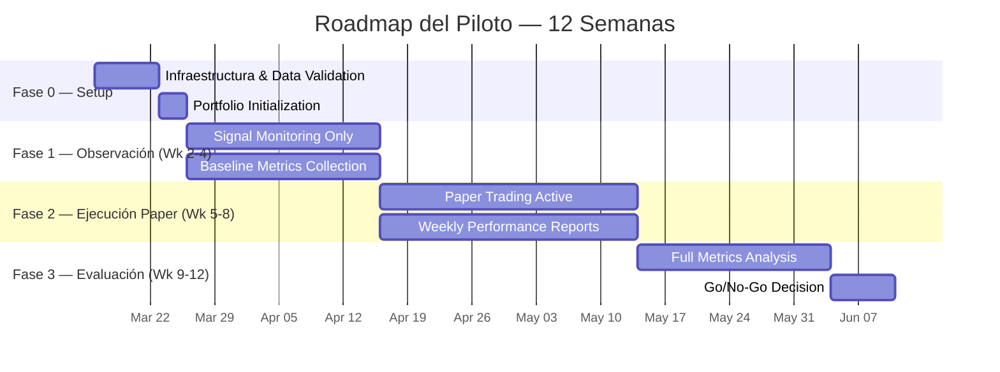
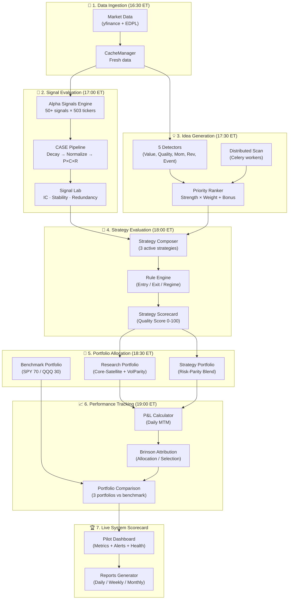
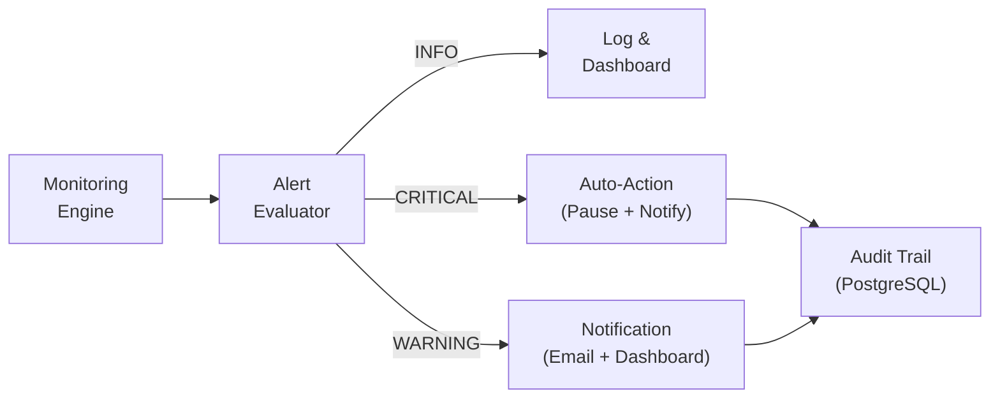

Proceder con fase 0# 365 Advisers — Pilot Deployment Design

> **Objetivo**: Validar el sistema completo de 365 Advisers en condiciones de producción limitada, midiendo la calidad de señales, ideas, estrategias y portafolios antes de un lanzamiento más amplio.

---

## 1. Alcance y Parámetros del Piloto

### 1.1 Parámetros Generales

| Parámetro | Valor | Justificación |
|:---|:---|:---|
| **Duración** | **12 semanas** (3 meses) | Cubre al menos un ciclo de earnings completo y permite evaluar regímenes de mercado |
| **Universo** | **S&P 500** (503 constituents) | Liquidez alta, cobertura de datos confiable, benchmark estándar |
| **Frecuencia de análisis** | **Diaria** (cierre de mercado) | Permite detectar cambios en señales y scores con granularidad suficiente |
| **Frecuencia de rebalanceo** | **Semanal** (viernes) | Equilibrio entre captura de alpha y costos de transacción |
| **Capital simulado** | **$1,000,000 USD** (paper trading) | Capital institucional mínimo representativo |
| **Fecha de inicio objetivo** | **Semana 1** del piloto | Tras completar la fase de setup y validación |

### 1.2 Tipos de Señales Utilizadas

El piloto utilizará el stack completo de señales disponible en la Alpha Signals Library:

| Categoría | Señales | Frecuencia Esperada |
|:---|:---|:---|
| **Momentum** (7) | RSI extremos, MACD crosses, SMA200 trend, etc. | Alta (diaria) |
| **Value** (7) | P/E vs histórico, FCF Yield, EV/EBIT, etc. | Media (semanal) |
| **Quality** (6) | ROIC consistency, Moat score, margin stability | Baja (quincenal) |
| **Volatility** (6) | Bollinger squeeze, ATR breakout, vol regime | Alta (diaria) |
| **Flow** (6) | Institutional flow, dark pool, share buyback | Media (semanal) |
| **Sentiment** (6) | News sentiment shift, analyst revision, social | Alta (diaria) |
| **Macro** (6) | Yield curve, VIX regime, sector rotation | Baja (semanal) |
| **Seasonality** (6) | Calendar effects, earnings seasonality | Baja (mensual) |

### 1.3 Fases del Piloto



---

## 2. Portafolios del Piloto

El piloto ejecutará **tres portafolios simultáneos** para permitir comparación directa.

### 2.1 Research Portfolio 📊

> Portafolio construido a partir de **señales e ideas** generadas automáticamente.

| Parámetro | Valor |
|:---|:---|
| **Fuente de decisiones** | Idea Generation Engine → señales de la Alpha Library |
| **Criterio de entrada** | CASE Score ≥ 65 AND UOS ≥ 7.0 AND ≥ 3 señales activas |
| **Criterio de salida** | CASE Score < 40 OR trailing stop -12% OR time stop 30 días |
| **Sizing** | Volatility Parity (ATR-adjusted) |
| **Max posiciones** | 20 |
| **Max por sector** | 25% |
| **Max por posición** | 10% |
| **Rebalanceo** | Semanal (viernes) |
| **Régimen** | Reduce 50% en Bear, full exposure en Bull/Range |

**Flujo de construcción:**
```
Alpha Signals Library → CASE Pipeline (Decay → Backtest → P×C×R)
                       → Idea Generation Engine (5 Detectors)
                       → Global Ranking (UOS ≥ 7.0)
                       → Portfolio Engine (Core-Satellite + VolParity)
                       → Research Portfolio
```

### 2.2 Strategy Portfolio 🧪

> Portafolio construido con **estrategias predefinidas** del Strategy Lab.

| Parámetro | Valor |
|:---|:---|
| **Fuente de decisiones** | Strategy Research Lab (SRL) con templates predefinidos |
| **Estrategias activas** | 3 estrategias en blend |
| **Blend method** | Risk-Parity (contribución de riesgo igualada) |
| **Max posiciones totales** | 30 (10 por estrategia) |
| **Rebalanceo** | Semanal (viernes) |

**Estrategias del blend:**

| Estrategia | Categoría | Señales Primarias | Horizonte |
|:---|:---|:---|:---|
| **Momentum Quality** | `momentum` | Momentum + Quality signals | Medium |
| **Value Contrarian** | `value` | Value + Reversal signals | Long |
| **Low Volatility** | `low_vol` | Volatility + Quality signals | Long |

**Flujo de construcción:**
```
Strategy Definition Framework (YAML configs)
  → Strategy Composer (filter + compose)
  → Rule Engine (entry/exit/regime)
  → Backtest Validation (walk-forward)
  → Portfolio Lab Blender (Risk-Parity mix)
  → Strategy Portfolio
```

### 2.3 Benchmark Portfolio 📈

> Portafolio de referencia pasivo para comparación.

| Parámetro | Valor |
|:---|:---|
| **Instrumento primario** | SPY (S&P 500 ETF) — 70% |
| **Instrumento secundario** | QQQ (Nasdaq 100 ETF) — 30% |
| **Rebalanceo** | Mensual |
| **Sizing** | Buy-and-hold estático |

> [!NOTE]
> El blend 70/30 SPY/QQQ refleja una exposición representativa al mercado con un ligero sesgo hacia tecnología, alineado con el universo S&P 500 del piloto.

---

## 3. Métricas de Evaluación

### 3.1 Métricas por Nivel

#### Nivel 1: Calidad de Señales

| Métrica | Definición | Target Piloto | Frecuencia |
|:---|:---|:---|:---|
| **Hit Rate** | % de señales que resultan en forward return positivo | ≥ 55% | Diaria |
| **Avg Forward Return (5d)** | Retorno promedio 5 días después de señal | > 0.3% | Diaria |
| **Avg Forward Return (20d)** | Retorno promedio 20 días después de señal | > 1.0% | Semanal |
| **Information Coefficient (IC)** | Correlación entre predicción y retorno real | > 0.03 | Semanal |
| **IC_IR** | IC / std(IC) — estabilidad del IC | > 0.5 | Semanal |
| **Signal Turnover** | % de cambios de señal por período | < 40% | Semanal |
| **Signal Breadth** | Número de señales activas concurrentes (avg) | > 15 | Diaria |

#### Nivel 2: Calidad de Ideas

| Métrica | Definición | Target Piloto | Frecuencia |
|:---|:---|:---|:---|
| **Idea Hit Rate** | % de ideas que generan retorno positivo a 20 días | ≥ 52% | Semanal |
| **Idea Alpha** | Retorno de idea vs retorno del sector | > 0.5% | Semanal |
| **Idea Decay Rate** | Tiempo medio hasta que la idea pierde relevancia | > 10 días | Semanal |
| **Detector Precision** | Hit rate por tipo de detector (Value, Momentum, etc.) | ≥ 50% cada | Semanal |
| **Ideas Generated / Week** | Throughput del scan de ideas | 15–50 | Semanal |

#### Nivel 3: Desempeño de Estrategias

| Métrica | Definición | Target Piloto | Frecuencia |
|:---|:---|:---|:---|
| **Sharpe Ratio** | Retorno ajustado por riesgo (annualized) | > 1.0 | Semanal |
| **Sortino Ratio** | Retorno ajustado por downside risk | > 1.2 | Semanal |
| **Max Drawdown** | Caída máxima desde pico | < 15% | Diaria |
| **Calmar Ratio** | Retorno anualizado / Max Drawdown | > 0.8 | Mensual |
| **Win Rate** | % de trades ganadores | ≥ 55% | Semanal |
| **Avg Win / Avg Loss** | Ratio de magnitud de ganancias vs pérdidas | > 1.3 | Semanal |
| **Strategy Quality Score** | Score compuesto del Scorecard del SRL (0-100) | > 65 | Semanal |
| **Regime Stability** | Consistencia de performance across Bull/Bear/Range | Sharpe > 0 en todos | Mensual |

#### Nivel 4: Desempeño de Portafolios

| Métrica | Definición | Target Piloto | Frecuencia |
|:---|:---|:---|:---|
| **Portfolio Return** | Retorno total acumulado (paper) | > Benchmark | Diaria |
| **Alpha vs Benchmark** | Retorno excedente vs SPY/QQQ blend | > 0% | Diaria |
| **Information Ratio** | Alpha / Tracking Error | > 0.3 | Semanal |
| **Portfolio Volatility** | Desviación estándar anualizada | < 20% | Diaria |
| **Portfolio Sharpe** | Retorno de portafolio / Volatility | > 0.8 | Semanal |
| **Turnover** | % del portafolio rotado por rebalanceo | < 30% / semana | Semanal |
| **Sector Concentration** | Max exposure a un sector | ≤ 25% | Diaria |
| **Brinson Alpha Decomposition** | Allocation + Selection + Interaction effects | Selection > 0 | Mensual |

### 3.2 Scoreboard Consolidado

```
┌──────────────────────────────────────────────────────────┐
│               PILOT HEALTH SCOREBOARD                    │
├──────────────────────────────────────────────────────────┤
│  SIGNALS      ●  Hit Rate: 58%    IC: 0.04   [HEALTHY]  │
│  IDEAS        ●  Hit Rate: 54%    Alpha: +0.7% [GOOD]   │
│  STRATEGIES   ●  Sharpe: 1.2      DD: -8%    [STRONG]   │
│  PORTFOLIOS   ●  Alpha: +2.1%     IR: 0.45   [ON TRACK] │
├──────────────────────────────────────────────────────────┤
│  SYSTEM       ●  Uptime: 99.8%   Latency: 1.2s [OK]    │
└──────────────────────────────────────────────────────────┘
```

---

## 4. Arquitectura de Ejecución

### 4.1 Flujo del Ciclo Diario del Piloto



### 4.2 Scheduler de Ejecución

| Hora (ET) | Tarea | Engine(s) | Duración Est. |
|:---|:---|:---|:---|
| 16:30 | Data Ingestion | CacheManager + EDPL | ~5 min |
| 17:00 | Signal Evaluation | Alpha Signals + CASE + Signal Lab | ~15 min |
| 17:30 | Idea Generation | Idea Gen Engine (Celery distributed) | ~10 min |
| 18:00 | Strategy Evaluation | Strategy Composer + Rule Engine + Scorecard | ~10 min |
| 18:30 | Portfolio Allocation | Portfolio Engine + Portfolio Lab Blender | ~5 min |
| 19:00 | Performance Tracking | P&L + Attribution + Comparison | ~5 min |
| 19:15 | Dashboard & Alerts | Live Scorecard + Monitoring Engine | ~3 min |
| 19:30 | Daily Snapshot | DB Persistence + Report Archive | ~2 min |

> [!IMPORTANT]
> Todo el ciclo diario debe completarse en **< 60 minutos** desde el cierre de mercado. El scheduler debería implementarse como una cadena de tareas Celery con dependencias secuenciales.

---

## 5. Sistema de Monitoreo y Alertas

### 5.1 Monitoreo Continuo

#### Daily Performance Tracking

| Componente | Datos Rastreados | Almacenamiento |
|:---|:---|:---|
| **Portfolio P&L** | NAV diario, return diario, return acumulado | `pilot_daily_snapshots` (PostgreSQL) |
| **Signal Performance** | Hit rate rolling 5d/20d, IC rolling | `pilot_signal_metrics` |
| **Strategy Health** | Equity curve, drawdown, quality score | `pilot_strategy_metrics` |
| **System Health** | Uptime, latencia, errores, data freshness | `pilot_system_health` |

#### Weekly Performance Reports

```
Weekly Pilot Report — Week {N} of 12
━━━━━━━━━━━━━━━━━━━━━━━━━━━━━━━━━━━
§1. Portfolio Performance Summary
    • Research Portfolio: +1.2% (WoW), +3.8% (cumulative)
    • Strategy Portfolio: +0.9% (WoW), +2.5% (cumulative)
    • Benchmark: +0.5% (WoW), +1.8% (cumulative)

§2. Signal Leaderboard (Top 5 by Hit Rate)
    1. RSI_Reversal_Deep    HR: 72%  Avg Return: +1.8%
    2. MACD_Cross_Bull      HR: 65%  Avg Return: +1.2%
    3. Buyback_Announce     HR: 63%  Avg Return: +0.9%
    ...

§3. Strategy Leaderboard
    1. Momentum Quality     Sharpe: 1.4  DD: -5.2%  QScore: 78
    2. Low Volatility       Sharpe: 1.1  DD: -3.8%  QScore: 72
    3. Value Contrarian     Sharpe: 0.8  DD: -7.1%  QScore: 65

§4. Key Observations & Risks
§5. Recommendations
```

### 5.2 Leaderboards

#### Signal Leaderboard

| Ranking Criteria | Método | Update |
|:---|:---|:---|
| **Hit Rate (20d)** | Top 10 signals by forward return success | Diario |
| **IC Contribution** | Signals sorted by IC × breadth | Semanal |
| **Decay Resistance** | Signals with longest effective half-life | Semanal |
| **Category Performance** | Aggregated performance by signal category | Semanal |

#### Strategy Leaderboard

| Ranking Criteria | Método | Update |
|:---|:---|:---|
| **Quality Score** | Composite from Scorecard (0-100) | Diario |
| **Risk-Adjusted Return** | Sharpe Ratio (annualized) | Diario |
| **Stability** | Performance consistency across regimes | Semanal |
| **Alpha Generation** | Excess return vs benchmark (annualized) | Diario |

### 5.3 Sistema de Alertas

> [!CAUTION]
> Las alertas críticas deben pausar automáticamente la ejecución del portafolio afectado hasta revisión manual.

#### Definición de Alertas

| Alerta | Condición de Disparo | Severidad | Acción |
|:---|:---|:---|:---|
| **Signal Degradation** | Hit Rate (rolling 20d) cae por debajo de 45% para una categoría completa | ⚠️ WARNING | Reducir peso de categoría 50% |
| **Strategy Drawdown** | Drawdown de cualquier estrategia > 10% | ⚠️ WARNING | Evaluar pausa de estrategia |
| **Strategy Drawdown Critical** | Drawdown de cualquier estrategia > 15% | 🛑 CRITICAL | Pausar estrategia automáticamente |
| **Portfolio Volatility Spike** | Volatilidad anualizada > 25% (rolling 5d) | ⚠️ WARNING | Reducir exposición 25% |
| **Portfolio Volatility Critical** | Volatilidad anualizada > 35% | 🛑 CRITICAL | Emergency de-risk a 50% cash |
| **Data Staleness** | Datos de mercado no actualizados > 2 horas post-cierre | ⚠️ WARNING | Skip daily run, notify admin |
| **CASE Score Collapse** | ≥ 30% de señales pasan a estado "Expired" simultáneamente | ⚠️ WARNING | Congelar nuevas entradas |
| **Correlation Spike** | Correlación intra-portafolio > 0.7 (rolling 20d) | ⚠️ WARNING | Evaluar diversificación |
| **Regime Change** | Detector de régimen cambia a Bear | 📋 INFO | Aplicar regime rules a todas las estrategias |

#### Flujo de Alertas



---

## 6. Reportes del Piloto

### 6.1 Catálogo de Reportes

| Reporte | Frecuencia | Audiencia | Contenido Clave |
|:---|:---|:---|:---|
| **Daily Pilot Snapshot** | Diaria | Equipo técnico | P&L, señales activas, alertas, system health |
| **Weekly Research Report** | Semanal (lunes) | Analysts + PMs | Performance semanal, signal/strategy leaderboards, ideas generadas, observaciones |
| **Strategy Performance Report** | Semanal (lunes) | Quant researchers | Equity curves, Brinson attribution, regime analysis, quality scores |
| **System Health Report** | Semanal (viernes) | Engineering | Uptime, latency, error rates, data coverage, pipeline completion |
| **Monthly Pilot Review** | Mensual | Steering Committee | Resumen ejecutivo, go/no-go assessment, métricas vs targets, risks |
| **Final Pilot Report** | Semana 12 | Board | Evaluación completa, recomendación de lanzamiento, plan de scaling |

### 6.2 Estructura del Weekly Research Report

```
╔══════════════════════════════════════════════════╗
║         WEEKLY RESEARCH REPORT                   ║
║         365 Advisers Pilot — Week {N}            ║
╠══════════════════════════════════════════════════╣
║                                                  ║
║  1. EXECUTIVE SUMMARY                            ║
║     • Sistema status: HEALTHY / DEGRADED / DOWN  ║
║     • Pilot progress: {N}/12 weeks completed     ║
║     • Overall alpha vs benchmark: +X.X%          ║
║                                                  ║
║  2. PORTFOLIO PERFORMANCE                        ║
║     ┌────────────────┬────────┬──────────┐       ║
║     │ Portfolio       │ WoW    │ Cumul.   │       ║
║     ├────────────────┼────────┼──────────┤       ║
║     │ Research        │ +1.2%  │ +3.8%    │       ║
║     │ Strategy        │ +0.9%  │ +2.5%    │       ║
║     │ Benchmark       │ +0.5%  │ +1.8%    │       ║
║     └────────────────┴────────┴──────────┘       ║
║                                                  ║
║  3. SIGNAL LEADERBOARD (Top 10)                  ║
║  4. STRATEGY LEADERBOARD                         ║
║  5. IDEAS GENERATED & PERFORMANCE                ║
║  6. REGIME & MACRO CONTEXT                       ║
║  7. ALERTS & INCIDENTS                           ║
║  8. RECOMMENDATIONS FOR NEXT WEEK                ║
║                                                  ║
╚══════════════════════════════════════════════════╝
```

---

## 7. Panel del Piloto (Dashboard)

### 7.1 Layout del Dashboard

```
┌─────────────────────────────────────────────────────────────────────────────┐
│                    365 ADVISERS — PILOT COMMAND CENTER                      │
│  Week 6 of 12  │  Status: HEALTHY  │  Last Update: 2026-04-27 19:15 ET    │
├─────────────────────────────┬───────────────────────────────────────────────┤
│                             │                                               │
│  📈 PORTFOLIO PERFORMANCE   │  🔬 ACTIVE IDEAS                             │
│                             │                                               │
│  ┌─ Equity Curves ────────┐│  ┌──────────────────────────────────────────┐ │
│  │ [Research]  ─── +3.8%  ││  │ AAPL  │ Momentum+Quality │ CASE: 82    │ │
│  │ [Strategy]  ─── +2.5%  ││  │ NVDA  │ Event+Flow       │ CASE: 78    │ │
│  │ [Benchmark] ─── +1.8%  ││  │ JNJ   │ Value+Quality    │ CASE: 75    │ │
│  │                        ││  │ GOOGL │ Momentum         │ CASE: 71    │ │
│  │  (6-week chart)        ││  │ ... (20 active ideas)                   │ │
│  └────────────────────────┘│  └──────────────────────────────────────────┘ │
│                             │                                               │
├─────────────────────────────┼───────────────────────────────────────────────┤
│                             │                                               │
│  💼 PORTFOLIO POSITIONS     │  📊 PERFORMANCE vs BENCHMARK                 │
│                             │                                               │
│  Research Portfolio:        │  ┌─ Alpha Chart ─────────────────────────┐   │
│  ┌────┬──────┬──────┬─────┐ │  │                                       │   │
│  │Tkr │ Wt%  │ P&L  │Type ││  │  Research  ───  +2.0% alpha           │   │
│  ├────┼──────┼──────┼─────┤ │  │  Strategy  ───  +0.7% alpha           │   │
│  │AAPL│ 8.2% │+3.1% │Core ││  │                                       │   │
│  │MSFT│ 7.8% │+2.4% │Core ││  │  (cumulative alpha vs benchmark)      │   │
│  │NVDA│ 6.1% │+5.2% │Sat  ││  └───────────────────────────────────────┘   │
│  │... │      │      │     ││                                               │
│  └────┴──────┴──────┴─────┘ │  Sharpe  │ Res: 1.2  │ Str: 0.9  │ B: 0.6  │
│                             │  MaxDD   │ Res: -6%  │ Str: -4%  │ B: -8%  │
│                             │  IR      │ Res: 0.45 │ Str: 0.30 │         │
├─────────────────────────────┴───────────────────────────────────────────────┤
│                                                                             │
│  🏥 SYSTEM HEALTH INDICATORS                                               │
│                                                                             │
│  Pipeline     ● COMPLETE    │ Data Fresh    ● YES (16:35 ET)               │
│  Signals      ● 47 active   │ Strategies    ● 3/3 running                  │
│  Alerts       ● 0 critical  │ Uptime        ● 99.8% (30d)                  │
│  DB Status    ● HEALTHY     │ Queue Depth   ● 0 pending                    │
│                                                                             │
│  Recent Alerts:                                                             │
│  ⚠️ 2026-04-25 17:12 — Signal category "Volatility" hit rate dipped to 48% │
│  ℹ️ 2026-04-24 18:00 — Regime shifted from Range to Bull                   │
│                                                                             │
└─────────────────────────────────────────────────────────────────────────────┘
```

### 7.2 Componentes del Dashboard

| Componente | Datos Mostrados | Interactividad |
|:---|:---|:---|
| **Equity Curves** | NAV diario de los 3 portafolios superpuestos | Hover para valores exactos, zoom temporal |
| **Active Ideas** | Lista de ideas vigentes con ticker, tipo, CASE score | Click para ver detalle de señales |
| **Portfolio Positions** | Posiciones actuales con peso, P&L, tipo (Core/Satellite) | Filtro por portafolio, sort por columna |
| **Alpha Chart** | Alpha acumulado vs benchmark | Toggle entre Research y Strategy |
| **Performance Metrics** | Sharpe, MaxDD, IR en formato tarjeta | Color-coded vs targets |
| **System Health** | Indicadores de salud del pipeline y datos | Semáforo (verde/amarillo/rojo) |
| **Alert Feed** | Historial cronológico de alertas | Filtro por severidad |
| **Signal Heatmap** | Mapa de calor de señales activas por categoría | Click para drill-down por categoría |
| **Strategy Radar** | Radar chart comparando 3 estrategias en 5 dimensiones | Overlay toggle |

---

## 8. Usuarios del Piloto

### 8.1 Roles y Permisos

| Rol | Cantidad | Acceso | Responsabilidad |
|:---|:---|:---|:---|
| **Pilot Director** | 1 | Dashboard completo + Admin + Override | Go/No-Go final, escalaciones, steering reports |
| **Quant Researcher** | 2–3 | Dashboard + Signal Lab + Strategy Lab | Analizar calidad de señales, ajustar estrategias |
| **Internal Analyst** | 3–5 | Dashboard + Ideas + Reports (read-only) | Validar ideas cualitativas, feedback de calidad |
| **Systems Engineer** | 1–2 | System Health + Logs + Admin | Monitorear infraestructura, resolver incidentes |

### 8.2 Onboarding del Piloto

Cada participante recibirá:
1. **Guía del Piloto** — Documento con objetivos, métricas, y reglas de operación
2. **Acceso al Dashboard** — Credenciales y tour guiado del panel del piloto
3. **Protocolo de Alertas** — Qué hacer ante cada tipo de alerta
4. **Canal de Comunicación** — Canal dedicado (Slack/Teams) para el equipo piloto
5. **Feedback Template** — Formulario semanal para reportar observaciones y sugerencias

---

## 9. Roadmap de Ejecución

### Fase 0 — Setup & Calibración (Semana 1)

| Tarea | Detalle | Responsable |
|:---|:---|:---|
| Validar datos de mercado | Confirmar cobertura S&P 500 completa via yfinance + EDPL | Systems Engineer |
| Inicializar portafolios | Crear los 3 portafolios con capital simulado $1M cada uno | Quant Researcher |
| Activar scheduler | Configurar cadena Celery para el ciclo diario post-mercado | Systems Engineer |
| Calibrar alertas | Verificar que los thresholds de alertas generan notificaciones correctas | Pilot Director |
| Deploy dashboard piloto | Dashboard accesible para todos los participantes | Systems Engineer |
| Sesión de onboarding | Walkthrough del sistema con todos los participantes | Pilot Director |
| Smoke test completo | Ejecutar un ciclo completo end-to-end con datos del día anterior | Quant Researcher |

### Fase 1 — Observación Pasiva (Semanas 2–4)

| Objetivo | Actividades |
|:---|:---|
| Observar calidad de señales **sin** tomar posiciones | Ejecutar el ciclo diario completo |
| Establecer baselines de métricas | Recolectar hit rates, IC, signal breadth |
| Identificar señales ruidosas | Analizar señales con hit rate < 45% |
| Validar régimen detection | Confirmar que el detector de régimen refleja condiciones de mercado |
| Ajustar thresholds si necesario | Calibrar CASE score mínimos y UOS thresholds |

> **Entregable Fase 1**: Baseline Report con métricas de referencia y ajustes de calibración.

### Fase 2 — Paper Trading Activo (Semanas 5–8)

| Objetivo | Actividades |
|:---|:---|
| Activar los 3 portafolios en paper mode | Research + Strategy + Benchmark |
| Ejecutar rebalanceos semanales | Viernes post-cierre |
| Generar reportes semanales | Weekly Research Report + Strategy Performance Report |
| Monitorear alertas activamente | Responder según protocolo definido |
| Reuniones semanales del piloto | Review de performance + decisiones de ajuste |

> **Entregable Fase 2**: 4 Weekly Reports + Strategy Leaderboard + Signal Leaderboard acumulado.

### Fase 3 — Evaluación y Decisión (Semanas 9–12)

| Objetivo | Actividades |
|:---|:---|
| Análisis completo de métricas | Comparar vs targets definidos en §3 |
| Brinson Attribution detallado | Descomponer alpha en Allocation, Selection, Interaction |
| Regime analysis | Performance por régimen (Bull/Bear/Range) |
| Stress testing | Evaluar peor semana y peor drawdown |
| Go/No-Go assessment | Compilar evidencia para decisión de lanzamiento |
| Final Pilot Report | Documento ejecutivo con recomendación |

> **Entregable Fase 3**: Final Pilot Report + Go/No-Go Recommendation.

---

## 10. Criterios de Éxito (Go / No-Go)

### 10.1 Criterios Cuantitativos

El piloto genera una recomendación **GO** si se cumplen **≥ 4 de 6** criterios:

| # | Criterio | Threshold | Pregunta que Responde |
|:---|:---|:---|:---|
| 1 | **Signal Hit Rate** (aggregate, 20d forward) | ≥ 53% | ¿Las señales funcionan? |
| 2 | **Research Portfolio Alpha** vs benchmark | > 0% (positivo) | ¿Las ideas generan alpha? |
| 3 | **Strategy Portfolio Sharpe** | > 0.8 | ¿Las estrategias son robustas? |
| 4 | **Max Drawdown** (todos los portfolios) | < 20% | ¿El riesgo está controlado? |
| 5 | **Strategy Quality Score** (promedio) | > 60 | ¿Las estrategias son estables? |
| 6 | **System Uptime** | > 99% | ¿La infraestructura es confiable? |

### 10.2 Criterios Cualitativos

| Pregunta | Evaluación |
|:---|:---|
| ¿Las ideas generadas son **accionables** para un analista humano? | Feedback de los Internal Analysts |
| ¿Los reportes aportan **insight** que no se obtiene de otros sistemas? | Encuesta de participantes |
| ¿El sistema produce **decisiones útiles** de forma consistente? | Evaluación del Pilot Director |
| ¿Los regímenes de mercado fueron **detectados correctamente**? | Validación post-hoc vs movimientos reales |

### 10.3 Decisión Final

```mermaid
flowchart TD
    EVAL["Pilot Evaluation\n(Week 12)"]
    Q1{"≥ 4/6 cuantitative\ncriteria met?"}
    Q2{"Qualitative feedback\npositive?"}
    
    GO["🟢 GO\nProceed to\nLimited Production"]
    EXTEND["🟡 EXTEND\n4 more weeks\nwith adjustments"]
    NOGO["🔴 NO-GO\nReturn to\nResearch Mode"]

    EVAL --> Q1
    Q1 -->|Yes| Q2
    Q1 -->|No (3/6)| EXTEND
    Q1 -->|No (≤2/6)| NOGO
    Q2 -->|Yes| GO
    Q2 -->|Mixed| EXTEND
    Q2 -->|Negative| NOGO
```

### 10.4 Post-Piloto: Scaling Path

| Resultado | Siguiente Paso |
|:---|:---|
| 🟢 **GO** | Escalar a universo ampliado (Russell 1000), activar más estrategias, onboard usuarios externos |
| 🟡 **EXTEND** | Ajustar parámetros problemáticos, extender piloto 4 semanas, re-evaluar |
| 🔴 **NO-GO** | Identificar causas raíz, regresar al Strategy Lab para optimización, re-intentar en 8 semanas |

---

## 11. Resumen de Entregables

| Entregable | Status | Sección |
|:---|:---|:---|
| ✅ Diseño completo del Pilot Deployment | Incluido | §1–§10 |
| ✅ Arquitectura de ejecución | Incluido | §4 |
| ✅ Portafolios del piloto | Incluido | §2 |
| ✅ Métricas de evaluación | Incluido | §3 |
| ✅ Panel de seguimiento (Dashboard) | Incluido | §7 |
| ✅ Reportes del piloto | Incluido | §6 |
| ✅ Sistema de monitoreo y alertas | Incluido | §5 |
| ✅ Usuarios y roles | Incluido | §8 |
| ✅ Roadmap de ejecución (fase a fase) | Incluido | §9 |
| ✅ Criterios de éxito (Go/No-Go) | Incluido | §10 |
