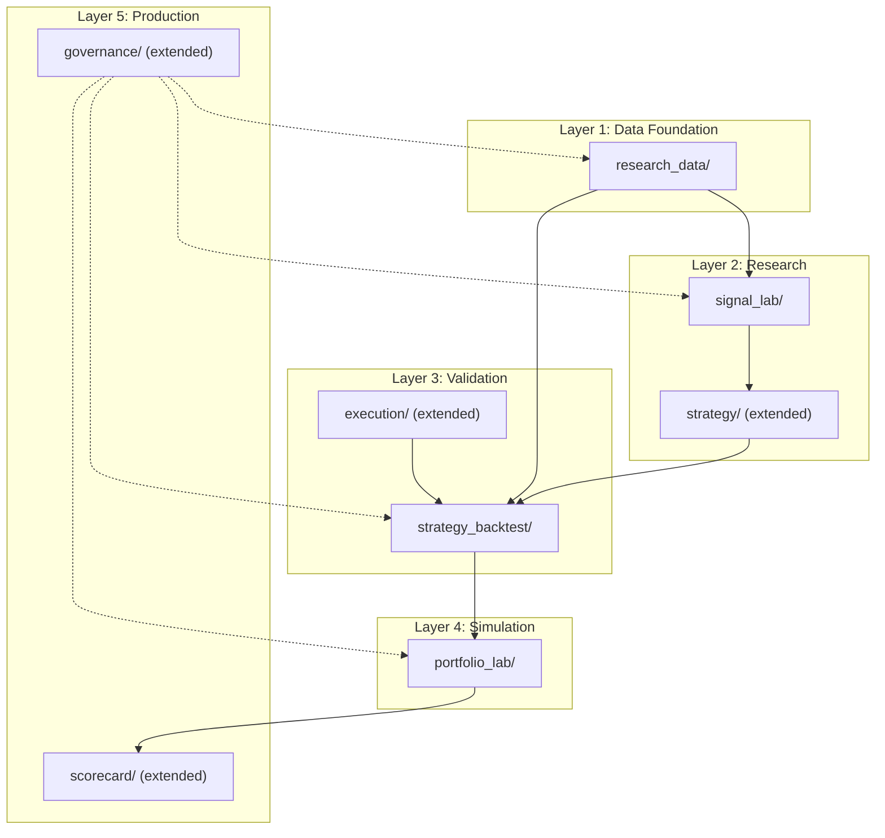

# 365 Advisers — Quant Research Platform Evolution

> Architectural blueprint for evolving the Investment Intelligence Terminal into an
> institutional-grade Quant Research Platform comparable to AQR, Citadel, and Two Sigma
> research stacks.

---

## 1. Capability Diagnostic

### Current System Inventory

| Layer | Modules | Status |
|:--|:--|:--|
| **Data** | `market_data`, `external/` (6 adapters), `providers/`, `repositories/` | Operational |
| **Fundamental** | LangGraph committee, 4 analyst agents, research memo | Operational |
| **Technical** | Indicators → Scoring → Formatter pipeline | Operational |
| **Signals** | `alpha_signals/` (50+), `signal_discovery/`, `signal_selection/`, `signal_ensemble/` | Operational |
| **Alpha** | `composite_alpha/` (CASE), `alpha_decay/`, `crowding/`, `regime_weights/` | Operational |
| **Scoring** | `scoring/` (12-factor Opportunity Model), `ranking/` | Operational |
| **Decision** | `decision/` (Matrix + CIO Agent) | Operational |
| **Portfolio** | `portfolio/` (Core-Satellite), `sizing/` (Vol Parity), `shadow/` | Operational |
| **Backtesting** | `backtesting/`, `walk_forward/` | Operational |
| **Validation** | QVF, `benchmark_factor/`, `concept_drift/`, `validation_dashboard/` | Operational |
| **Governance** | `governance/` (experiments, lineage, versioning), `monitoring/` | Operational |
| **Execution** | `execution/` (fill model stub), `cost_model/`, `liquidity/` | Partial |
| **Learning** | `meta_learning/`, `online_learning/`, `allocation_learning/` | Operational |
| **Ideas** | `idea_generation/` (5 detectors, distributed) | Operational |
| **Tracking** | `opportunity_tracking/`, `scorecard/` | Operational |
| **Strategy** | `strategy/` | Stub |
| **Infra** | PostgreSQL, Redis, Celery, FastAPI, Next.js | Operational |

**Total: 34 engine modules across 17 layers.**

### What 365 Advisers Already Has (vs. Institutional Stacks)

| Capability | AQR/Citadel Level | 365 Advisers | Gap |
|:--|:--|:--|:--|
| Multi-source data ingestion | ✅ | ✅ (6 adapters + EDPL) | Coverage breadth |
| Signal library | ✅ | ✅ (50+ signals, 8 categories) | Discovery automation |
| Signal decay / half-life | ✅ | ✅ (alpha_decay) | — |
| Regime detection | ✅ | ✅ (regime_weights) | Regime-adaptive reweighting |
| Crowding detection | ✅ | ✅ (crowding) | — |
| Walk-forward backtesting | ✅ | ✅ (walk_forward) | Strategy-level backtests |
| Factor decomposition | ✅ | ✅ (benchmark_factor) | Multi-factor attribution |
| Transaction cost modeling | ✅ | 🟡 (cost_model stub) | Fill / slippage / impact |
| Concept drift detection | ✅ | ✅ (concept_drift) | — |
| Shadow portfolios | ✅ | ✅ (shadow) | P&L reconciliation |
| Experiment tracking | ✅ | ✅ (governance) | Reproducibility |
| Research datasets | ✅ | ❌ | **New layer needed** |
| Strategy definition DSL | ✅ | ❌ | **New layer needed** |
| Strategy backtesting | ✅ | ❌ | **New layer needed** |
| Portfolio simulation lab | ✅ | ❌ | **New layer needed** |
| Live performance scorecards | ✅ | 🟡 (scorecard basic) | Full attribution |
| Execution simulation | ✅ | 🟡 (execution stub) | **Needs completion** |

### Gap Summary

The system has **strong signal-level infrastructure** but lacks:

1. **Research Dataset Layer** — no reusable, versioned datasets
2. **Signal Research Lab** — discovery exists but lacks evaluation harness
3. **Strategy abstraction** — no way to define strategies declaratively
4. **Strategy backtesting** — backtesting is signal-level only
5. **Execution simulation** — realistic fills/slippage not modeled
6. **Portfolio simulation lab** — no multi-portfolio comparison
7. **Live attribution** — scorecard exists but lacks benchmark decomposition

---

## 2. Evolved Architecture

```
┌─────────────────────────────────────────────────────────────────────┐
│                     QUANT RESEARCH PLATFORM                        │
│                                                                     │
│  ┌──────────────┐  ┌──────────────┐  ┌──────────────┐              │
│  │   Research    │  │   Signal     │  │   Strategy   │              │
│  │  Dataset Layer│  │ Research Lab │  │ Research Lab │              │
│  │              │  │              │  │              │              │
│  │  FeatureStore │  │  Discovery   │  │  Definition  │              │
│  │  SignalStore  │  │  Evaluation  │  │  Composition │              │
│  │  BacktestDB  │  │  Comparison  │  │  Backtesting │              │
│  │  ValidationDB │  │  Stability   │  │  Attribution │              │
│  └──────┬───────┘  └──────┬───────┘  └──────┬───────┘              │
│         │                 │                 │                       │
│  ┌──────▼─────────────────▼─────────────────▼───────┐              │
│  │              EXECUTION SIMULATION                 │              │
│  │   Fill Model · Slippage · Spread · Market Impact  │              │
│  └──────────────────────┬────────────────────────────┘              │
│                         │                                           │
│  ┌──────────────────────▼────────────────────────────┐              │
│  │            PORTFOLIO SIMULATION LAB                │              │
│  │   Research · Strategy · Benchmark · Shadow         │              │
│  └──────────────────────┬────────────────────────────┘              │
│                         │                                           │
│  ┌──────────────────────▼────────────────────────────┐              │
│  │         LIVE PERFORMANCE MONITORING                │              │
│  │   Signal Scorecard · Strategy Scorecard            │              │
│  │   Idea Scorecard · Alpha vs Benchmark              │              │
│  └──────────────────────┬────────────────────────────┘              │
│                         │                                           │
│  ┌──────────────────────▼────────────────────────────┐              │
│  │         RESEARCH GOVERNANCE (existing)             │              │
│  │   Experiments · Lineage · Versioning · Audit       │              │
│  └───────────────────────────────────────────────────┘              │
│                                                                     │
│  ════════════════════════════════════════════════════════           │
│  EXISTING FOUNDATION (preserved)                                   │
│  Data · Signals · Alpha · Scoring · Decision · Portfolio · Infra   │
└─────────────────────────────────────────────────────────────────────┘
```

---

## 3. New Layers — Detailed Design

### 3.1 Research Dataset Layer

**Purpose**: Provide versioned, reproducible datasets for all research activities.

**Location**: `src/engines/research_data/`

#### Modules

| Module | Description |
|:--|:--|
| `feature_store.py` | FeatureStore — versioned feature vectors per ticker×date |
| `signal_store.py` | SignalStore — historical signal fire/decay records |
| `backtest_store.py` | BacktestStore — persisted backtest results with metadata |
| `dataset_builder.py` | DatasetBuilder — compose features + signals into research-ready dataframes |
| `snapshot.py` | PointInTimeSnapshot — prevent lookahead bias in feature construction |
| `models.py` | SQLAlchemy models: `feature_snapshots`, `signal_history`, `backtest_results` |

#### Contracts

```python
class FeatureSnapshot(BaseModel):
    ticker: str
    date: date
    feature_set: str          # "fundamental_v3", "technical_v2"
    features: dict[str, float]
    source_versions: dict     # provenance
    created_at: datetime

class ResearchDataset(BaseModel):
    name: str
    version: str
    tickers: list[str]
    date_range: tuple[date, date]
    feature_sets: list[str]
    signals_included: list[str]
    row_count: int
    metadata: dict
```

#### Integration

- **Consumes**: `market_data`, `external/` adapters, `alpha_signals/`
- **Consumed by**: Signal Research Lab, Strategy Research Lab, Backtesting
- **Extends**: `database.py` (new tables), `governance/` (dataset versioning)

---

### 3.2 Signal Research Lab

**Purpose**: Systematic environment for discovering, evaluating, and comparing signals.

**Location**: `src/engines/signal_lab/`

#### Modules

| Module | Description |
|:--|:--|
| `evaluator.py` | SignalEvaluator — compute IC, turnover, decay, stability for any signal |
| `comparator.py` | SignalComparator — pairwise correlation, redundancy matrix, marginal value |
| `stability.py` | StabilityAnalyzer — bootstrap stability, Monte Carlo perturbation |
| `redundancy.py` | RedundancyDetector — identify signals with > threshold correlation |
| `report.py` | LabReport — generate structured evaluation report |
| `models.py` | `signal_evaluations`, `signal_comparisons` tables |

#### Key Metrics Per Signal

| Metric | Description |
|:--|:--|
| IC (Information Coefficient) | Rank correlation with forward returns |
| IC_IR (IC Information Ratio) | IC mean / IC std — consistency |
| Turnover | Signal flip frequency |
| Decay Profile | IC at t+1, t+5, t+21 |
| Breadth | Fraction of universe with non-zero signal |
| Regime Sensitivity | IC variance by macro regime |
| Marginal IC | IC after orthogonalizing to existing signals |

#### Integration

- **Consumes**: `research_data/`, `alpha_signals/`, `signal_discovery/`
- **Consumed by**: `signal_selection/`, `signal_ensemble/`, `governance/`
- **Extends**: `signal_discovery/` (adds evaluation harness), `validation_dashboard/`

---

### 3.3 Strategy Research Layer

**Purpose**: Declarative strategy definition, composition, and management.

**Location**: `src/engines/strategy/` (extends existing stub)

#### Modules

| Module | Description |
|:--|:--|
| `definition.py` | StrategyDefinition — declarative strategy spec (signals, rules, constraints) |
| `composer.py` | StrategyComposer — combine signals + scoring + portfolio rules |
| `registry.py` | StrategyRegistry — register, version, and retrieve strategies |
| `models.py` | `strategies`, `strategy_versions` tables |

#### Strategy Definition Schema

```python
class StrategyDefinition(BaseModel):
    name: str                          # "Momentum Quality"
    version: str                       # "1.2.0"
    description: str

    # Signal layer
    signal_universe: list[str]         # IDs from alpha_signals
    signal_weights: dict[str, float]   # or "equal" / "ic_weighted"
    signal_combination: str            # "linear" | "voting" | "ml_ensemble"

    # Scoring layer
    scoring_model: str                 # "opportunity_score" | "custom"
    score_threshold: float             # minimum to act

    # Portfolio rules
    max_positions: int
    position_sizing: str               # "volatility_parity" | "equal" | "risk_budget"
    rebalance_frequency: str           # "daily" | "weekly" | "monthly"
    turnover_constraint: float | None

    # Risk constraints
    max_sector_exposure: float
    max_single_position: float
    stop_loss: float | None

    # Metadata
    author: str
    created_at: datetime
    tags: list[str]
```

#### Predefined Strategies (Examples)

| Strategy | Signals | Sizing | Rebalance |
|:--|:--|:--|:--|
| Momentum Quality | momentum signals + quality signals | Vol parity | Weekly |
| Value Contrarian | valuation signals + mean reversion | Equal weight | Monthly |
| AI Infrastructure | sector detector + growth signals | Risk budget | Monthly |
| Event Driven | filing events + geopolitical | Equal weight | Daily |

#### Integration

- **Consumes**: `alpha_signals/`, `scoring/`, `portfolio/`
- **Consumed by**: Strategy Backtesting, Portfolio Lab
- **Extends**: existing `strategy/` stub

---

### 3.4 Strategy Backtesting Framework

**Purpose**: Full strategy-level backtesting with realistic execution and risk-adjusted metrics.

**Location**: `src/engines/strategy_backtest/`

#### Modules

| Module | Description |
|:--|:--|
| `engine.py` | StrategyBacktester — runs strategy through historical data |
| `walk_forward.py` | WalkForwardStrategy — expanding/rolling window strategy evaluation |
| `metrics.py` | StrategyMetrics — Sharpe, Sortino, max drawdown, Calmar, turnover, costs |
| `benchmark.py` | BenchmarkComparison — alpha vs SPY, factor-adjusted returns |
| `regime_analysis.py` | RegimePerformance — performance breakdown by macro regime |
| `report.py` | BacktestReport — structured output with visualizations data |
| `models.py` | `strategy_backtests`, `strategy_backtest_trades` tables |

#### Outputs

```python
class StrategyBacktestResult(BaseModel):
    strategy_name: str
    strategy_version: str
    period: tuple[date, date]
    
    # Returns
    total_return: float
    annualized_return: float
    benchmark_return: float
    alpha: float
    
    # Risk
    volatility: float
    sharpe_ratio: float
    sortino_ratio: float
    max_drawdown: float
    calmar_ratio: float
    
    # Execution
    total_trades: int
    avg_turnover: float
    total_costs: float
    net_return: float        # after costs
    
    # Regime breakdown
    regime_performance: dict[str, float]
    
    # Equity curve (for plotting)
    equity_curve: list[dict]  # [{date, value, benchmark}]
```

#### Integration

- **Consumes**: `strategy/`, `research_data/`, `execution/` (cost model)
- **Consumed by**: Portfolio Lab, Live Monitoring
- **Extends**: existing `backtesting/`, `walk_forward/`

---

### 3.5 Execution Simulation

**Purpose**: Realistic modeling of trade execution to bridge backtest results to real-world outcomes.

**Location**: `src/engines/execution/` (extends existing stub)

#### Modules

| Module | Description |
|:--|:--|
| `fill_model.py` | FillModel — probability of fill at limit/market (extends stub) |
| `slippage_model.py` | SlippageModel — size-dependent price impact estimation |
| `spread_model.py` | SpreadModel — bid-ask spread modeling by liquidity tier |
| `impact_model.py` | MarketImpactModel — Almgren-Chriss temporary/permanent impact |
| `cost_aggregator.py` | ExecutionCostAggregator — total cost = commission + spread + slippage + impact |
| `models.py` | `execution_simulations` table |

#### Cost Model Interface

```python
class ExecutionCost(BaseModel):
    commission_bps: float      # broker commission
    spread_bps: float          # half bid-ask spread
    slippage_bps: float        # size-dependent slippage
    market_impact_bps: float   # permanent price impact
    total_bps: float           # sum
    
    # Context
    order_size_shares: int
    adv_pct: float             # order as % of avg daily volume
    liquidity_tier: str        # "mega_cap" | "large_cap" | "mid_cap" | "small_cap"
```

#### Integration

- **Consumes**: `market_data` (ADV, spread), `liquidity/`
- **Consumed by**: Strategy Backtesting, Portfolio Lab
- **Extends**: existing `execution/`, `cost_model/`

---

### 3.6 Research Governance Layer

**Purpose**: Institutional audit trail for all research activities.

**Location**: `src/engines/governance/` (extends existing)

#### Extensions to Existing Module

| Extension | Description |
|:--|:--|
| `reproducibility.py` | ReproducibilityTracker — hash inputs, parameters, outputs for exact replay |
| `dataset_versioning.py` | DatasetVersionControl — track which dataset version each experiment used |
| `approval_workflow.py` | ApprovalGate — require review before strategy goes live |
| `audit_report.py` | AuditReportGenerator — compliance-ready audit trail export |

#### Reproducibility Record

```python
class ExperimentRecord(BaseModel):
    experiment_id: str
    type: str                  # "signal_eval" | "strategy_backtest" | "portfolio_sim"
    
    # Inputs (hashed for reproducibility)
    dataset_version: str
    parameter_hash: str
    code_version: str          # git commit SHA
    
    # Outputs
    result_summary: dict
    artifacts: list[str]       # paths to saved outputs
    
    # Metadata
    author: str
    created_at: datetime
    status: str                # "draft" | "reviewed" | "approved" | "archived"
```

#### Integration

- **Consumes**: All research layers
- **Consumed by**: Audit dashboard, compliance export
- **Extends**: existing `governance/`

---

### 3.7 Strategy Portfolio Lab

**Purpose**: Multi-portfolio simulation and comparison environment.

**Location**: `src/engines/portfolio_lab/`

#### Modules

| Module | Description |
|:--|:--|
| `simulator.py` | PortfolioSimulator — run portfolio through historical period |
| `comparison.py` | PortfolioComparator — side-by-side strategy/portfolio comparison |
| `benchmark.py` | BenchmarkPortfolio — SPY, 60/40, equal weight index |
| `attribution.py` | PerformanceAttribution — Brinson, factor, signal-level attribution |
| `report.py` | PortfolioLabReport — comparison report with equity curves |
| `models.py` | `portfolio_simulations`, `portfolio_comparisons` tables |

#### Portfolio Types

| Type | Purpose |
|:--|:--|
| **Research Portfolio** | Signals-only portfolio to measure raw signal alpha |
| **Strategy Portfolio** | Full strategy with sizing, constraints, costs |
| **Benchmark Portfolio** | Passive benchmark for comparison (SPY, sector ETF) |
| **Shadow Portfolio** | Live paper-trading (already exists in `shadow/`) |

#### Integration

- **Consumes**: `strategy_backtest/`, `execution/`, `shadow/`
- **Consumed by**: Live Monitoring, UX
- **Extends**: existing `shadow/`, `portfolio/`

---

### 3.8 Live Performance Monitoring

**Purpose**: Real-time scorecards measuring system decision quality in production.

**Location**: `src/engines/scorecard/` (extends existing)

#### Extensions

| Extension | Description |
|:--|:--|
| `signal_scorecard.py` | SignalScorecard — IC, hit rate, P&L contribution per signal (live) |
| `strategy_scorecard.py` | StrategyScorecard — live strategy performance vs backtest expectations |
| `idea_scorecard.py` | IdeaScorecard — track idea outcomes (already partial in `opportunity_tracking/`) |
| `alpha_dashboard.py` | AlphaDashboard — total alpha vs benchmark decomposition |
| `alert_rules.py` | AlertRules — trigger alerts when performance deviates from expectations |

#### Scorecard Metrics

```python
class LiveScorecard(BaseModel):
    period: str                    # "1d" | "1w" | "1m" | "3m" | "ytd"
    
    # Signal performance
    signals_fired: int
    signal_hit_rate: float
    avg_signal_ic: float
    best_signal: str
    worst_signal: str
    
    # Strategy performance
    strategy_return: float
    benchmark_return: float
    active_return: float           # alpha
    tracking_error: float
    information_ratio: float
    
    # Idea performance
    ideas_generated: int
    ideas_acted_on: int
    idea_success_rate: float
    
    # System health
    model_drift_score: float
    data_coverage_avg: float
    avg_latency_ms: float
```

#### Integration

- **Consumes**: `shadow/`, `opportunity_tracking/`, `alpha_signals/`, `concept_drift/`
- **Consumed by**: UX (System Intelligence view), alerting
- **Extends**: existing `scorecard/`, `opportunity_tracking/`

---

## 4. Module Impact Summary

### New Modules (to create)

| Module | Files Est. | Complexity | Layer |
|:--|:--|:--|:--|
| `research_data/` | 6 | Medium | Dataset |
| `signal_lab/` | 6 | High | Signal Research |
| `strategy_backtest/` | 7 | High | Strategy |
| `portfolio_lab/` | 6 | Medium | Portfolio |

### Existing Modules (to extend)

| Module | Extensions | Impact |
|:--|:--|:--|
| `strategy/` | StrategyDefinition, Composer, Registry | Moderate — flesh out stub |
| `execution/` | FillModel, Slippage, Spread, Impact | Moderate — complete stub |
| `governance/` | Reproducibility, Dataset versioning, Approval | Light — add modules |
| `scorecard/` | SignalScorecard, StrategyScorecard, Alpha dashboard | Moderate — expand |
| `database.py` | ~8 new tables | Light |
| `routes/` | 4 new API routers | Light |

### Modules Unchanged

All existing engines remain untouched:
`fundamental/`, `technical/`, `alpha_signals/`, `composite_alpha/`, `alpha_decay/`,
`scoring/`, `decision/`, `portfolio/`, `sizing/`, `backtesting/`, `walk_forward/`,
`crowding/`, `regime_weights/`, `concept_drift/`, `meta_learning/`, `online_learning/`,
`idea_generation/`, `ranking/`, `validation_dashboard/`, `benchmark_factor/`,
`liquidity/`, `monitoring/`

---

## 5. Dependency Map



**Build order**: Layer 1 → 2 → 3 → 4 → 5

---

## 6. Implementation Roadmap

### Phase 1 — Research Data Foundation (2–3 sessions)

| Step | Module | Description | Deps |
|:--|:--|:--|:--|
| 1.1 | `research_data/models.py` | DB tables for features, signals, backtests | — |
| 1.2 | `research_data/feature_store.py` | Feature snapshot storage & retrieval | 1.1 |
| 1.3 | `research_data/signal_store.py` | Historical signal fire records | 1.1 |
| 1.4 | `research_data/dataset_builder.py` | Compose research datasets | 1.2, 1.3 |
| 1.5 | `research_data/snapshot.py` | Point-in-time bias prevention | 1.4 |
| 1.6 | API: `routes/research.py` | CRUD endpoints for datasets | 1.4 |

### Phase 2 — Signal Research Lab (2–3 sessions)

| Step | Module | Description | Deps |
|:--|:--|:--|:--|
| 2.1 | `signal_lab/evaluator.py` | IC, turnover, decay, breadth per signal | Phase 1 |
| 2.2 | `signal_lab/comparator.py` | Pairwise correlation & redundancy | 2.1 |
| 2.3 | `signal_lab/stability.py` | Bootstrap & Monte Carlo stability | 2.1 |
| 2.4 | `signal_lab/redundancy.py` | Auto-detect redundant signals | 2.2 |
| 2.5 | `signal_lab/report.py` | Structured evaluation report | 2.1–2.4 |
| 2.6 | API: `routes/signal_lab.py` | Lab evaluation endpoints | 2.5 |

### Phase 3 — Strategy Layer + Execution (2–3 sessions)

| Step | Module | Description | Deps |
|:--|:--|:--|:--|
| 3.1 | `strategy/definition.py` | Declarative strategy schema | — |
| 3.2 | `strategy/composer.py` | Strategy composition from signals | 3.1, Phase 2 |
| 3.3 | `strategy/registry.py` | Strategy version registry | 3.1 |
| 3.4 | `execution/slippage_model.py` | Size-dependent slippage | — |
| 3.5 | `execution/spread_model.py` | Bid-ask spread model | — |
| 3.6 | `execution/impact_model.py` | Almgren-Chriss market impact | 3.4 |
| 3.7 | `execution/cost_aggregator.py` | Total cost aggregation | 3.4–3.6 |

### Phase 4 — Strategy Backtesting (2–3 sessions)

| Step | Module | Description | Deps |
|:--|:--|:--|:--|
| 4.1 | `strategy_backtest/engine.py` | Core strategy backtester | Phase 3 |
| 4.2 | `strategy_backtest/walk_forward.py` | Walk-forward strategy evaluation | 4.1 |
| 4.3 | `strategy_backtest/metrics.py` | Risk-adjusted metrics suite | 4.1 |
| 4.4 | `strategy_backtest/benchmark.py` | Benchmark comparison | 4.3 |
| 4.5 | `strategy_backtest/regime_analysis.py` | Regime-dependent performance | 4.3 |
| 4.6 | `strategy_backtest/report.py` | Structured backtest report | 4.1–4.5 |
| 4.7 | API: `routes/strategy.py` | Strategy + backtest endpoints | 4.6 |

### Phase 5 — Portfolio Lab + Governance (2–3 sessions)

| Step | Module | Description | Deps |
|:--|:--|:--|:--|
| 5.1 | `portfolio_lab/simulator.py` | Multi-portfolio simulator | Phase 4 |
| 5.2 | `portfolio_lab/comparison.py` | Side-by-side comparison | 5.1 |
| 5.3 | `portfolio_lab/attribution.py` | Performance attribution | 5.1 |
| 5.4 | `portfolio_lab/benchmark.py` | Benchmark portfolio definitions | — |
| 5.5 | `governance/reproducibility.py` | Full experiment reproducibility | Phase 1 |
| 5.6 | `governance/approval_workflow.py` | Research approval gates | 5.5 |
| 5.7 | API: `routes/portfolio_lab.py` | Lab endpoints | 5.3 |

### Phase 6 — Live Performance + UX (2–3 sessions)

| Step | Module | Description | Deps |
|:--|:--|:--|:--|
| 6.1 | `scorecard/signal_scorecard.py` | Live signal performance tracking | Phase 2 |
| 6.2 | `scorecard/strategy_scorecard.py` | Live strategy vs expectations | Phase 4 |
| 6.3 | `scorecard/alpha_dashboard.py` | Alpha vs benchmark decomposition | 6.2 |
| 6.4 | `scorecard/alert_rules.py` | Performance deviation alerts | 6.1–6.3 |
| 6.5 | Frontend: Signal Lab UI components | Evaluation results display | Phase 2 |
| 6.6 | Frontend: Strategy Lab UI components | Strategy definition + backtest views | Phase 4 |
| 6.7 | Frontend: Portfolio Lab UI components | Comparison dashboards | Phase 5 |

---

## 7. Priorities

| Phase | Impact | Complexity | Horizon | Priority |
|:--|:--|:--|:--|:--|
| Phase 1 — Research Data | 🔥 Foundational | Medium | Near | **P0** |
| Phase 2 — Signal Lab | 🔥 High alpha value | High | Near | **P0** |
| Phase 3 — Strategy + Execution | 🔥 Strategy formalization | Medium | Mid | **P1** |
| Phase 4 — Strategy Backtesting | 🔥 Strategy validation | High | Mid | **P1** |
| Phase 5 — Portfolio Lab + Governance | Medium | Medium | Mid | **P2** |
| Phase 6 — Live Monitoring + UX | Medium | Medium | Mid–Long | **P2** |

---

## 8. Design Principles

| Principle | Application |
|:--|:--|
| **Low coupling** | Each layer has clean contracts; no direct engine imports across layers |
| **Incremental adoption** | Each phase is independently useful; Phase 1 alone accelerates all research |
| **Backward compatibility** | Zero changes to existing 34 engines; only additive modules |
| **Graceful degradation** | Missing layers produce "not available" rather than errors |
| **Modular architecture** | Each new module is self-contained with its own models, logic, API |
| **Reproducibility** | Every experiment records inputs, parameters, code version, outputs |

---

*Last updated: 2026-03-07*
