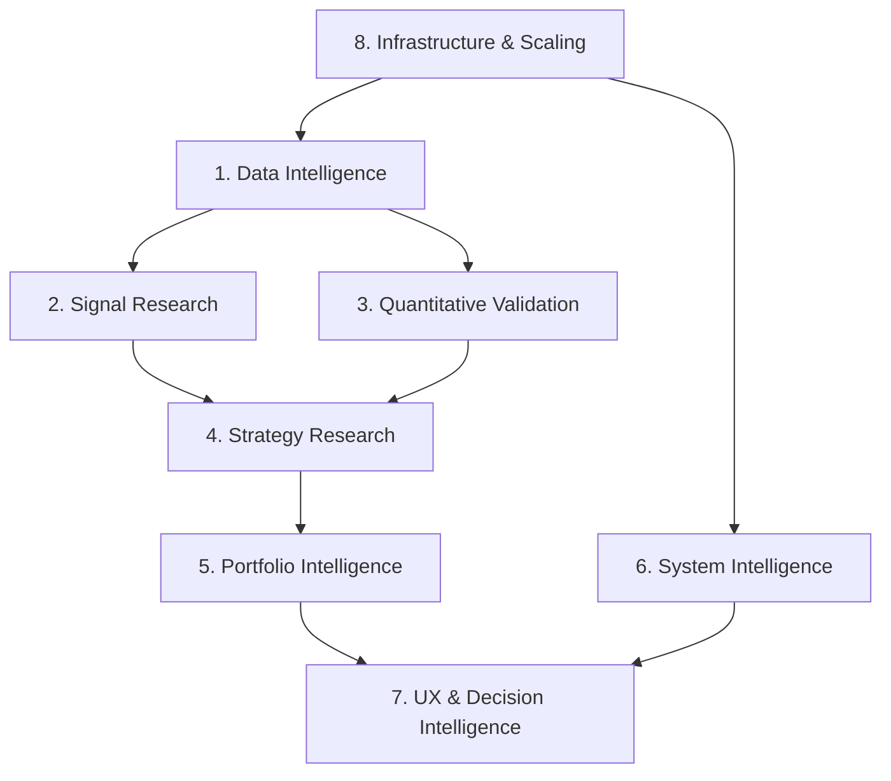
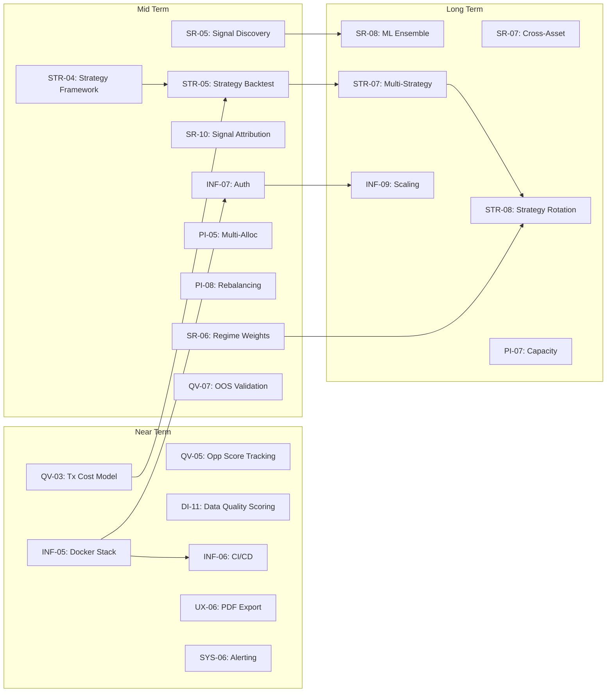

# 365 Advisers — Research Roadmap

> **Strategic research program** for evolving 365 Advisers into an adaptive investment intelligence platform.
> Organized as 8 research programs with prioritized initiatives, dependencies, and implementation horizons.

---

## Program Overview

| # | Program | Status | Initiatives | Horizon |
|:--|:--|:--|:--|:--|
| 1 | Data Intelligence | 🟢 Foundation complete | 12 | Near–Mid |
| 2 | Signal Research | 🟢 Core complete | 10 | Near–Long |
| 3 | Quantitative Validation | 🟢 Core complete | 8 | Mid–Long |
| 4 | Strategy Research | 🟡 Emerging | 9 | Mid–Long |
| 5 | Portfolio Intelligence | 🟡 Partial | 8 | Mid–Long |
| 6 | System Intelligence | 🟢 Operational | 7 | Near–Mid |
| 7 | UX & Decision Intelligence | 🟢 Terminal shipped | 8 | Near–Mid |
| 8 | Infrastructure & Scaling | 🟡 Partial | 9 | Near–Long |

**Horizons**: 🔵 Near Term (next 1–3 sessions) · 🟡 Mid Term (4–10 sessions) · 🔴 Long Term (10+ sessions)

---

## 1. Data Intelligence

**Objective**: Build a resilient, multi-source data layer that feeds every downstream engine with normalized, fresh, and provenance-tracked data.

**Impact**: High — data quality is the foundation of all analysis quality.

### Completed Foundation

| ID | Initiative | Status | Tracker Ref |
|:--|:--|:--|:--|
| DI-01 | External Data Provider Layer (EDPL) | ✅ DONE | DS-001 |
| DI-02 | FRED macro adapter | ✅ DONE | DS-002 |
| DI-03 | Finnhub market/sentiment adapter | ✅ DONE | DS-003 |
| DI-04 | Quiver Quantitative adapter | ✅ DONE | DS-004 |
| DI-05 | SEC EDGAR filing adapter | ✅ DONE | DS-005 |
| DI-06 | GDELT geopolitical adapter | ✅ DONE | DS-006 |
| DI-07 | Source coverage & health persistence | ✅ DONE | SA-001, SA-007 |
| DI-08 | Stale data policy & fallback routing | ✅ DONE | SA-008 |

### Open Research

| ID | Initiative | Horizon | Priority | Deps | Impact |
|:--|:--|:--|:--|:--|:--|
| DI-09 | **Real-time WebSocket feeds** — Live price/order flow for intraday signals | 🟡 Mid | P2 | DI-01 | Enables real-time alpha |
| DI-10 | **Alternative data ingestion** — Patent filings, satellite imagery, social sentiment | 🔴 Long | P3 | DI-01 | Unique alpha sources |
| DI-11 | **Data quality scoring** — Automated freshness/completeness scoring per fetch | 🔵 Near | P2 | DI-07 | Better coverage metrics |
| DI-12 | **Historical data backfill** — Bulk backfill for backtesting enrichment | 🟡 Mid | P2 | DI-01 | Better backtests |

### Key Research Questions

- What is the marginal information value of each new data source?
- How does data staleness degrade signal accuracy?
- What is the optimal cache TTL per domain?

---

## 2. Signal Research

**Objective**: Discover, validate, and ensemble alpha signals that decay predictably and adapt to market regimes.

**Impact**: Critical — signals are the raw material of every investment decision.

### Completed Foundation

| ID | Initiative | Status | Tracker Ref |
|:--|:--|:--|:--|
| SR-01 | Alpha Signals Library (50+ across 8 categories) | ✅ DONE | QR-001 |
| SR-02 | Composite Alpha Score Engine (CASE) | ✅ DONE | QR-002 |
| SR-03 | Alpha Decay & Signal Half-Life Model | ✅ DONE | QR-003 |
| SR-04 | Signal Crowding Detection | ✅ DONE | QR-002 |

### Open Research

| ID | Initiative | Horizon | Priority | Deps | Impact |
|:--|:--|:--|:--|:--|:--|
| SR-05 | **Signal discovery pipeline** — Automated scanning for new alpha patterns | 🟡 Mid | P1 | SR-01 | Continuous alpha renewal |
| SR-06 | **Regime-adaptive signal weighting** — CASE weights adjust by macro regime | 🟡 Mid | P1 | SR-02, DI-02 | Regime resilience |
| SR-07 | **Cross-asset signal propagation** — Signals from related assets inform scoring | 🔴 Long | P2 | SR-01 | Sector intelligence |
| SR-08 | **Machine-learned signal ensembles** — ML-based optimal signal combination | 🔴 Long | P2 | SR-05, QV-03 | Higher SR |
| SR-09 | **Intraday signal detectors** — Sub-daily signal generation | 🔴 Long | P3 | DI-09 | Shorter alpha horizons |
| SR-10 | **Signal attribution analysis** — Decompose P&L by signal contribution | 🟡 Mid | P1 | SR-02, ER-04 | Research governance |

### Key Research Questions

- What is the optimal signal ensemble method (equal weight vs. information-ratio weighted)?
- How does signal crowding affect decay rates?
- Can regime detection improve signal selection in real-time?

---

## 3. Quantitative Validation

**Objective**: Ensure every model, signal, and strategy is empirically validated with rigorous, bias-free testing.

**Impact**: High — prevents overfitting and builds institutional trust.

### Completed Foundation

| ID | Initiative | Status | Tracker Ref |
|:--|:--|:--|:--|
| QV-01 | Quantitative Validation Framework (QVF) | ✅ DONE | QR-005 |
| QV-02 | Walk-forward backtesting | ✅ DONE | QR-004 |

### Open Research

| ID | Initiative | Horizon | Priority | Deps | Impact |
|:--|:--|:--|:--|:--|:--|
| QV-03 | **Transaction cost modeling** — Realistic cost impact on backtest P&L | 🔵 Near | P1 | ER-003 | Honest backtests |
| QV-04 | **Benchmark factor decomposition** — Fama-French + momentum attribution | 🟡 Mid | P2 | QR-006 | True alpha isolation |
| QV-05 | **Opportunity score performance tracking** — Track if scored opportunities perform | 🔵 Near | P1 | SL-001 | Score calibration |
| QV-06 | **Signal stability testing** — Monte Carlo stability of signals over time | 🟡 Mid | P2 | SR-01 | Signal confidence |
| QV-07 | **Out-of-sample validation framework** — Strict IS/OOS split with leakage detection | 🟡 Mid | P1 | QV-02 | Overfitting prevention |
| QV-08 | **Live vs. backtest performance comparison** — Shadow portfolio reconciliation | 🟡 Mid | P1 | ER-004 | Model integrity |

### Key Research Questions

- How much alpha disappears after transaction costs?
- What fraction of the opportunity score is explained by known factors?
- What is the maximum lookback bias in our signal library?

---

## 4. Strategy Research

**Objective**: Formalize investment strategies as composable, testable, and auditable programs.

**Impact**: High — bridges signal research to actionable portfolio decisions.

### Completed Foundation

| ID | Initiative | Status | Tracker Ref |
|:--|:--|:--|:--|
| STR-01 | Institutional Opportunity Score (12-factor) | ✅ DONE | SL-001 |
| STR-02 | Position Sizing Model (volatility parity) | ✅ DONE | SL-002 |
| STR-03 | Decision Matrix (9 postures) | ✅ DONE | SL-003 |

### Open Research

| ID | Initiative | Horizon | Priority | Deps | Impact |
|:--|:--|:--|:--|:--|:--|
| STR-04 | **Strategy definition framework** — Declarative strategy specs (entry/exit/sizing) | 🟡 Mid | P1 | STR-01 | Strategy formalization |
| STR-05 | **Strategy backtesting engine** — Full strategy-level backtest with allocation | 🟡 Mid | P1 | STR-04, QV-03 | Strategy validation |
| STR-06 | **Strategy performance dashboard** — Live tracking of strategy returns | 🟡 Mid | P2 | STR-05 | Performance attribution |
| STR-07 | **Multi-strategy simulation** — Run N strategies simultaneously | 🔴 Long | P2 | STR-05 | Strategy comparison |
| STR-08 | **Dynamic strategy rotation** — Regime-based strategy switching | 🔴 Long | P3 | STR-07, SR-06 | Adaptive allocation |
| STR-09 | **Strategy risk budgeting** — VaR/CVaR-constrained allocations | 🟡 Mid | P2 | STR-04 | Risk management |

### Key Research Questions

- Can strategies be expressed as composable building blocks?
- What is the optimal strategy rotation frequency?
- How does regime detection improve strategy selection?

---

## 5. Portfolio Intelligence

**Objective**: Build institutional-grade portfolio construction, rebalancing, and risk management.

**Impact**: High — transforms analysis into real capital allocation decisions.

### Completed Foundation

| ID | Initiative | Status | Tracker Ref |
|:--|:--|:--|:--|
| PI-01 | Core-Satellite allocation | ✅ DONE | SL-004 |
| PI-02 | Volatility Parity sizing | ✅ DONE | SL-002 |
| PI-03 | Scenario Analysis (What-If) | ✅ DONE | SL-005 |
| PI-04 | Shadow Portfolio Framework | ✅ DONE | ER-004 |

### Open Research

| ID | Initiative | Horizon | Priority | Deps | Impact |
|:--|:--|:--|:--|:--|:--|
| PI-05 | **Multi-strategy allocation** — Kelly, risk parity, mean-variance | 🟡 Mid | P2 | STR-04 | Allocation diversity |
| PI-06 | **Liquidity constraints** — Size positions by ADV and spread | 🔵 Near | P2 | DI-09 | Realistic sizing |
| PI-07 | **Capacity modeling** — Estimate strategy capacity before saturation | 🔴 Long | P3 | PI-06 | Scalability |
| PI-08 | **Rebalancing engine** — Automated drift detection + rebal triggers | 🟡 Mid | P2 | PI-01 | Portfolio maintenance |

### Key Research Questions

- What is the optimal rebalancing frequency for each strategy?
- How does portfolio liquidity impact realized alpha?
- What is the capacity of our current signal library?

---

## 6. System Intelligence

**Objective**: Monitor, detect, and auto-correct system health, model drift, and decision quality.

**Impact**: Medium-High — ensures long-term reliability without manual oversight.

### Completed Foundation

| ID | Initiative | Status | Tracker Ref |
|:--|:--|:--|:--|
| SYS-01 | System Intelligence dashboard | ✅ DONE | SI-001 |
| SYS-02 | Provider Health Dashboard | ✅ DONE | SI-002 |
| SYS-03 | Concept Drift Detection | ✅ DONE | RG-006 |
| SYS-04 | Model Monitoring Hub + Circuit Breaker | ✅ DONE | RG-005 |
| SYS-05 | Recalibration Log | ✅ DONE | SI-003 |

### Open Research

| ID | Initiative | Horizon | Priority | Deps | Impact |
|:--|:--|:--|:--|:--|:--|
| SYS-06 | **Alerting system** — Push notifications for anomalies (email/webhook) | 🔵 Near | P2 | SYS-01 | Proactive monitoring |
| SYS-07 | **Audit trail dashboard** — Full decision audit log viewer | 🟡 Mid | P2 | RG-004 | Compliance readiness |

### Key Research Questions

- What drift thresholds trigger automatic recalibration?
- How do we distinguish regime change from model degradation?

---

## 7. UX & Decision Intelligence

**Objective**: Present complex analysis in a way that accelerates confident decision-making.

**Impact**: High — the interface IS the product for end users.

### Completed Foundation

| ID | Initiative | Status | Tracker Ref |
|:--|:--|:--|:--|
| UX-01 | Institutional Terminal (5-view + Cmd+K) | ✅ DONE | UX-001 |
| UX-02 | Market Intelligence Map | ✅ DONE | UX-002 |
| UX-03 | Help Center | ✅ DONE | UX-003 |
| UX-04 | Splitscreen Comparison | ✅ DONE | UX-004 |
| UX-05 | Source Awareness components | ✅ DONE | SA-003–006 |

### Open Research

| ID | Initiative | Horizon | Priority | Deps | Impact |
|:--|:--|:--|:--|:--|:--|
| UX-06 | **CIO Memo PDF export** — Institutional-grade report generation | 🔵 Near | P2 | CM-001 | Client deliverable |
| UX-07 | **Onboarding overlay** — Guided first-run experience | 🟡 Mid | P3 | UX-01 | User retention |
| UX-08 | **Mobile responsive layout** — Full mobile optimization | 🔴 Long | P3 | UX-01 | Accessibility |

### Key Research Questions

- What information density maximizes decision speed without overload?
- Does progressive disclosure improve or hinder institutional users?

---

## 8. Infrastructure & Scaling

**Objective**: Build production-grade infrastructure that supports multi-user, real-time, distributed operation.

**Impact**: Critical for production — blocks multi-user deployment.

### Completed Foundation

| ID | Initiative | Status | Tracker Ref |
|:--|:--|:--|:--|
| INF-01 | PostgreSQL migration | ✅ DONE | IF-001 |
| INF-02 | Distributed Idea Generation (Celery/Redis) | ✅ DONE | IF-002 |
| INF-03 | Rate Limiting Middleware | ✅ DONE | IF-003 |
| INF-04 | Unified Cache Manager | ✅ DONE | IF-004 |

### Open Research

| ID | Initiative | Horizon | Priority | Deps | Impact |
|:--|:--|:--|:--|:--|:--|
| INF-05 | **Docker Compose stack** — Full containerized deployment | 🔵 Near | P1 | INF-01 | Deployment readiness |
| INF-06 | **CI/CD pipeline** — GitHub Actions: test → build → deploy | 🔵 Near | P1 | INF-05 | Dev velocity |
| INF-07 | **Authentication & multi-tenancy** — User login + API keys + tenant isolation | 🟡 Mid | P1 | INF-01 | Multi-user |
| INF-08 | **Monitoring & observability** — Prometheus + Grafana + structured logging | 🟡 Mid | P2 | INF-05 | Ops visibility |
| INF-09 | **Horizontal scaling** — Stateless backend + LB + read replicas | 🔴 Long | P3 | INF-05, INF-07 | Growth |

### Key Research Questions

- What is the optimal worker pool size for distributed scanning?
- What caching strategy minimizes API costs while maintaining freshness?

---

## Dependency Graph

---

## Prioritization Matrix

| Priority | Near Term 🔵 | Mid Term 🟡 | Long Term 🔴 |
|:--|:--|:--|:--|
| **P1** | INF-05, INF-06, QV-03, QV-05 | SR-05, SR-06, STR-04, STR-05, QV-07, INF-07 | — |
| **P2** | DI-11, UX-06, SYS-06, PI-06 | SR-10, QV-04, STR-06, STR-09, PI-05, PI-08, INF-08 | SR-07, SR-08, STR-07 |
| **P3** | — | UX-07 | DI-10, SR-09, STR-08, PI-07, UX-08, INF-09 |

---

## Recommended Session Sequence

### Next 3 Sessions (Near Term P1)

1. **INF-05 + INF-06**: Docker + CI/CD — unblocks deployment
2. **QV-03 + QV-05**: Transaction costs + opportunity tracking — validates scoring
3. **DI-11 + UX-06**: Data quality scoring + PDF export — visibility

### Sessions 4–10 (Mid Term P1)

4. **STR-04**: Strategy definition framework — formalizes strategies
5. **SR-05 + SR-06**: Signal discovery + regime weighting — evolves alpha
6. **STR-05 + QV-07**: Strategy backtesting + OOS validation — validates strategies
7. **INF-07**: Authentication — enables multi-user
8. **SR-10**: Signal attribution — research governance

### Sessions 10+ (Long Term)

9. **SR-07 + SR-08**: Cross-asset signals + ML ensembles
10. **STR-07 + STR-08**: Multi-strategy + rotation
11. **INF-09**: Horizontal scaling

---

## Operational Rules

1. **Every new research idea** → Add to the appropriate program in this roadmap + create tracker entry
2. **Every completed initiative** → Update status here and in `implementation_tracker.md`
3. **Session planning** → Start by reviewing Near Term P1 items
4. **Dependency check** → Never start an initiative if its dependencies are not `DONE`
5. **Quarterly review** → Reassess horizons and priorities based on research findings

---

*Last updated: 2026-03-07*
